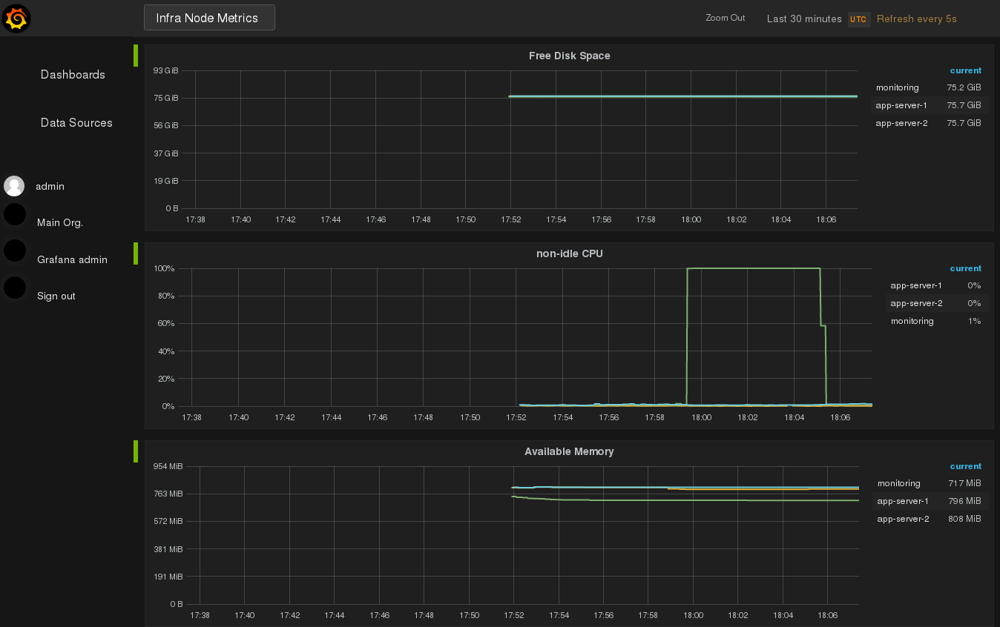

.. post:: 27 Oct, 2017
   :tags: monitoring
   :title: Monitoring with Prometheus

.. specific terms I use quite often

.. |ans| replace:: *Ansible*
.. |prom| replace:: *Prometheus*
.. |graf| replace:: *Grafana*
.. |vagr| replace:: *Vagrant*
.. |vb| replace:: *VirtualBox*

==========================
Monitoring with Prometheus
==========================

One of the common causes for service degradation or interruption is still
the failure or exhaustion of your basic infrastructure resources.
This post gives you an intro how you can monitor your basic resources
with |prom|. It shows the setup with |ans| and the data visualization
with |graf|. The post does **not** show all the capabilities of |prom|.
In fact, I'm showing you only the simplest configuration. The benefit
of this post is, that it takes you from start to finish and gives you
a playground you can easily recreate when things go wrong, thanks to
|vagr| and |vb|. Beware, as this is a non-trivial (non-hello-world)
example, the post is really long.

.. contents::
    :local:
    :backlinks: top

.. list-table:: Change history:
   :widths: 1 5
   :header-rows: 1

   * - Date
     - Change description
   * - 2017-10-27
     - The first release

TL;DR
=====

The short version of the actions you have to trigger is:

#. download the archive and extract the
   :download:`project source files <monitoring-with-prometheus-source.tar.gz>`

#. ensure you have installed: |vagr|, |vb| and |ans|

#. execute these steps in the console:

   .. code-block:: bash
      :linenos:

       $ vagrant up                                    # create the servers
       $ ansible-playbook -i hosts.ini playbook.yml    # establish monitoring
       $ vagrant ssh app-server-1                      # log into VM
       vagrant@app-server-1:~$ sudo su -               # become root user
       root@app-server-1:~# python eat_cpu.py &        # start demo application

Open your browser at http://192.168.100.10:3000/ and see the impact of
the demo application code. That's it. The next sections describe the steps
in more detail.

Use Case
========

One of the worst calls you can get as developer, is one from the user
who complains that the service is slow or -- even worse -- doesn't
respond anymore. A user should **never know before you**, that your
service doesn't behave in its parameters anymore.

Monitoring is a way of collecting and storing data (so called *metrics*)
so that you can extrapolate a trend out of the historic view, to give
you insights if preemptive actions are necessary to keep your promised
*Service Level Agreements* (SLAs).

This post will focus on the monitoring aspect of the resources your
service can consume. Specifically I'll go into details of monitoring:

* CPU
* memory
* disk space

For example, if you don't use *logrotation*, it's easy to consume all
disk space and become unserviceable. A bug in the thread handling can
also slow down your CPUs. And a good old memory leak is never out of fashion.

I cannot stress enough that having historic data is very valuable. A single
point in time observation is not enough. The show case here will use a specific
setup, which is explained below.

Setup Overview
==============

Our end result will look like this:

We will have 3 servers:
  * one monitoring server
  * two application server

We deploy small applications which consume different types of resources onto
the application servers. This will demonstrate the influence on the collected
metrics, which are stored on the monitoring server within |prom|.

You need several code files to repeat the actions in this post.
Use the full list of files below (or
:download:`the compressed archive <monitoring-with-prometheus-source.tar.gz>`):

* ``eat_cpu.py`` :download:`(download) <eat_cpu.py>`
  Demo application code to consume CPU cycles.
* ``eat_memory.py`` :download:`(download) <eat_memory.py>`
  Demo application code to consume RAM.
* ``eat_disk.py`` :download:`(download) <eat_disk.py>`
  Demo application code to consume disk space.
* ``Vagrantfile`` :download:`(download) <Vagrantfile>`
  Virtual environment description file (depends on |vb|)
* ``prometheus.yml`` :download:`(download) <prometheus.yml>`
  |prom| configuration file.
* ``grafana.ini`` :download:`(download) <grafana.ini>`
  |graf| configuration file.
* ``infra-node-metrics.json`` :download:`(download) <infra-node-metrics.json>`
  |graf| dashboard to visualize resource consumption.
* ``hosts.ini`` :download:`(download) <hosts.ini>`
  |ans| target hosts file to operate on.
* ``playbook.yml`` :download:`(download) <playbook.yml>`
  |ans| playbook to set up our environment.

I will describe the files more in detail when I use them later.
If you're less interested in the details and want to see the end result
first, you can jump to section :ref:`monitoring-metrics` and come back to
the details later.

Server Provisioning
===================

To create the servers described before, I'll utilize |vagr| with |vb| as
hypervisor. I use the term *provisioning* in the sense of creating the
servers and configuring the basic infra support functions (which includes
the monitoring). The configuration is done with |ans|. As described before
there are multiple files involved in this operation and they get explained
piece by piece below.

Vagrant
-------

Let's start with the ``Vagrantfile``. This file is the input for |vagr|
and describes the basic structure of our environment. Typically, I have
three parts in a Vagrantfile:

#. an array which **describes** the servers and their attributes
#. some general hypervisor settings
#. the logic to **create** the servers from the array

Lets take a look at the **first part**:

.. literalinclude:: Vagrantfile
   :language: ruby
   :linenos:
   :lines: 1-35
   :lineno-start: 1
   :emphasize-lines: 9

You'll notice that the three servers we mentioned in the previous section
get described here. I like the *Vagrant Box* from ``geerlingguy``, as it
works better as the official one from *Canonical*. I use predefined private
IPs (and not DNS), as I feed these IPs later to |ans|. Sometime I had issues
with host port clashes when working with multiple |vagr| environments at the
same time, so I usually predefine them as well. From time to time, I need
different amount of resources for a multi VM environment, so I added attributes
for CPUs and memory to my template as well.

The **second part** is this:

.. literalinclude:: Vagrantfile
   :language: ruby
   :linenos:
   :lines: 36-43
   :lineno-start: 36

I use a hypervisor specific feature from |vb| to speed things up a little.
When you destroy and create such an environment multiple times, this comes
in handy.

And the **third part** is this:

.. literalinclude:: Vagrantfile
   :language: ruby
   :linenos:
   :lines: 44-
   :lineno-start: 44
   :emphasize-lines: 4

This iterates through the servers defined in the first part and applies
all the attributes we defined.

With this file locally in place, you can influence the life cycle of your
servers with:

.. code-block:: bash
   :linenos:

   $ vagrant up          # create the servers
   $ vagrant destroy -f  # destroy the servers (forcefully)

Now we are ready to deploy something onto those servers.

Ansible hosts
-------------

I'm going to use more and more |ans| examples in this blog, as this is my
tool of choice for such tasks. Doing such things with the shell looks smaller
and easier at first, but the more nodes you have, the more |ans| comes in handy.
If you haven't tried it yet, give it a chance, it's awesome.

|ans| needs a file which specifies its targets to operate on. It uses the
``ini`` syntax and you can name it whatever you want, I called it
``hosts.ini`` throughout this post. The content is:

.. literalinclude:: hosts.ini
   :language: ini
   :linenos:
   :emphasize-lines: 0

.. warning::
   Do **not** store passwords like that when using |ans|. Use the
   *Ansible Vault* feature [#ansivault]_ for that. I excluded it from the
   scope of this post.

You'll recognize the servers we described in the ``Vagrantfile`` before.
If you don't provide the ``ansible_host`` key-value-pair, a DNS name
resolution will be attempted.
As |ans| is *agentless* and uses plain SSH to access the targets, I used
the default credentials |vagr| creates when starting the servers. The servers
got separated into *groups* (or ``*.ini`` file sections). You can have groups of
groups too, which is is a powerful concept. These groups come in handy when
applying deployment logic based on these groups. The next section will
show that.

Ansible playbook
----------------

|ans| uses *playbooks* to encapsulate deployment and server configuration logic.
One playbooks can contain 1 to N *plays*. One *play* uses a group of servers
or a single server as a target. One *play* contains 1 to N *tasks*. A *task*
is the atomic building block and smallest unit of work in |ans|.

There is one *magic group* called ``all``. This
includes all the servers in the target file we specified before. The syntax
in playbooks is ``YAML`` and the file we use is the ``playbook.yml``. I used
one playbook to contain all necessary plays to keep it simple. Let's go through
the plays piece by piece. I'll show the code first and explain it below:

.. literalinclude:: playbook.yml
   :language: yaml
   :linenos:
   :emphasize-lines: 6,11,21,28,32
   :lines: 1-37

This is the **first play** and we use the magic group ``all`` as a target.
As described before, that includes all servers. From reading the ``name``
lines, you should get an idea **what** happens. You also see that I re-use
existing |ans| modules, namely ``wait_for``, ``lineinfile``, ``ping`` and
``apt``. I won't go into the details of the modules I used.
A full list of modules is available at [#ansmods]_, take a look at them
for the details. The goal of this play is to have the servers ready
for deploying the monitoring and applications later.

Keep in mind that everything here happens inside the servers (if not
delegated, like I did here to wait for SSH).
When working with virtual machines which got created a few seconds earlier,
sometimes the SSH service is not fully ready when starting the playbooks,
that's why I added a waiting logic.
|prom| will later use DNS name resolution, that's why I manipulated the
hosts file on these servers.

.. literalinclude:: playbook.yml
   :language: yaml
   :linenos:
   :emphasize-lines: 4,8,12,18
   :lines: 38-61
   :lineno-start: 38

After we have prepared the servers with the basic steps, we install
the operating system packaged version of one of many |prom| exporters [#promex]_,
the *Prometheus-Node-Exporter*. This exporter emits the metrics we are
interested in. The |prom| will later collect the from this URI.

I like to add small *"assert tasks"* which check conditions I expect to be there,
to fail fast if things go wrong. Here I do a simple HTTP GET request to see
if the exporter emits metrics.

Now that we have something to listen on, let's install the rest of the
monitoring.

.. literalinclude:: playbook.yml
   :language: yaml
   :linenos:
   :emphasize-lines: 4,16,28,39,51,81,93
   :lines: 62-167
   :lineno-start: 62

This is a big one. The important parts are highlighted. We apply this logic
only on the ``monitoring`` server. Three important files get used here:

* ``prometheus.yml`` configures |prom|
* ``grafana.ini`` configures |graf|
* ``infra-node-metrics.json`` example dashboard

If you want to have a reproducible infrastructure, it's good to save such
things in your version control system too. For the dashboard, I usually
create one in the |graf| web UI and use the export function to store the
generated JSON. Only for very small changes I edit the JSON file itself.

There are also again some tasks which assert that the services are up and
running. The ``handlers`` at the end get fired **after** the tasks are
finished.

With this logic, we have the monitoring in place. But we need something
to have impact on our resources. We need applications:

.. literalinclude:: playbook.yml
   :language: yaml
   :linenos:
   :emphasize-lines: 4
   :lines: 168-
   :lineno-start: 168

A very simple and short one this time. The application code we copy here
is shown in :ref:`appendix-a`.

.. tip::
   It's perfectly fine to start |ans| playbooks like I did here.
   For example, when you transition from shell scripts. At some point in
   time you should very strongly consider to encapsulated logic into
   *Ansible roles* [#ansiroles]_. Think of them as re-usable libraries
   with defined interfaces.

Now execute the playbook locally (not in any of the VMs):

.. code-block:: bash
   :linenos:

   $ ansible-playbook -i hosts.ini playbook.yml

While this command does its magic, let's have a look at the configuration
files we have copied to the monitoring node.

Prometheus
----------

You have seen in the playbook before, that we copy a file called
``prometheus.yml``. This is what it does:

.. literalinclude:: prometheus.yml
   :language: yaml
   :linenos:
   :emphasize-lines: 8,17,19,21

.. important::
   In newer versions of Prometheus, ``target_groups`` got replaced by
   ``static_configs`` [#promstatic]_ .

This is a static configuration, which only makes sense if your environment
does not change that often. There are more dynamic ones with service discovery,
but I won't dive into that right now. The highlighted lines are the interesting
ones. The meaning of these lines piece by piece:

* ``scrape_configs``: The act of collecting (pulling) metrics from a source
  is called *scraping* in |prom| terms. We can have N scrape configurations.
* ``job_name``: A *job*  abstracts 1 to N targets. For target specific
  resources (like in this post), this seems unnecessary. Imagine HTTP response
  times of your distributed, highly available application on the other hand.
  Then you don't care about a single HTTP server, but in the combined metrics.
  A job name could then be *"web-ui-app-x"* with multiple targets. I plan to
  write a post about ``HAProxy`` at some point, it will make more sense then.
* ``targets``: A *scrape job* can have multiple targets. We could have added
  both application servers here, but then both would get the same labels
  applied. The labels are one of the nice things of |prom| which distinguishes
  it from other monitoring software like *statsd*.
* ``name``: This is simply an arbitrarily chosen free-form label. Labels give
  you the ability to *tag* / *label* / *mark* / *annotate* your metrics.These
  values can later get used to set constraints in the |prom| query language.

The best metrics don't help, if you can't pull knowledge out of them and
derive actions from that knowledge. Visualizing data is the best method
(for me) to create knowledge from data, and |graf| does a very good job
at data visualization.

Grafana
-------

This is the last file we discuss, before finally monitoring our environment
and it's a very simple one:

.. literalinclude:: grafana.ini
   :language: ini
   :linenos:
   :emphasize-lines: 0

.. important::
   One of the (not shown here and thereby default) values I use is the
   admin password. Take care of that when you use |graf| in a sensitive
   environment (see [#grafdoc]_ for the full configuration).

The only thing I change from the defaults is, that I'd like to have reading
access for people not logged into |graf|. You still need to be logged in
to create, change or delete dashboards.

That's the last part of the automation we use. Let's check what we can do
with that.

.. _`monitoring-metrics`:

Monitor the metrics
===================

After the playbook is executed, open the prometheus server UI at
http://192.168.100.10:9090/status . You should see that all the expected
targets are listed and in state ``UP`` like in this image:

.. image:: prometheus-targets-status.png
   :target: /_images/prometheus-targets-status.png
   :alt: Prometheus status page with the expected outcome.

At http://192.168.100.10:9090/graph you can start using the Prometheus
query language [#promq]_ to create graphs based on the metrics the
Prometheus server scrapes from the targets in an interval. For example,
you can query the available disk space from the nodes by using
``node_filesystem_free{mountpoint='/', name!=''}``:

* ``node_filesystem_free``: This is the metric you're interested in
* ``{}``: Constraints get defined in curly brackets
* ``mountpoint='/'``: A constraint: only show metrics for the root directory
* ``name!=''``: A constraint: only show metrics with a value for label ``name``

The constraints get logically ``AND``'ed.

.. image:: prometheus-graph.png
   :target: /_images/prometheus-graph.png
   :alt: Prometheus graph page with a query for free disk space

.. note:: The (old) version of |prom| I used here adds itself
   automatically (not sure if this is a bug or a feature) additionally
   to the setting I did (with labels), so I ignore that entry with
   the constraint ``name!=''`` like you see in the image.

You'll notice very quickly that this gets ugly. For example, the metric
is in bytes, and you cannot transform it to a human readable unit. Let's
use *Grafana* to visualize that in a sensible way.

The Ansible playbook also installed and configured the |graf| service,
which is accessible at http://192.168.100.10:3000/.

Sign in as username ``admin`` and password ``admin``, and you'll see this:

.. image:: grafana-dashboard.png
   :target: /_images/grafana-dashboard.png
   :alt: |graf| dashboard visualizing Prometheus Node Exporter metrics

This is the dashboard created from the file ``infra-node-metrics.json``.
As said earlier, I usually use the edit functionality in the web UI to
create and change the dashboards and then export it as JSON file.

You can watch that for a while if you want to, but there won't be a lot
of action. We have to trigger something which consumes the resources
we monitor. That's where the application files we copied onto the
application servers come into play.
These files (``eat_cpu.py``, ``eat_memory.py`` and
``eat_disk.py``) are listed fully in :ref:`appendix-a`, I won't describe
them in detail in this post.

Fire up one of the applications (inside one or both of the application
servers) to consume some resources:

.. code-block:: bash
   :linenos:

   [markus@home] $ vagrant ssh app-server-1
   [...]
   vagrant@app-server-1:~$ sudo su -
   root@app-server-1:~#
   root@app-server-1:~#
   root@app-server-1:~# python eat_cpu.py &
   [1] 2392
   root@app-server-1:~# kill -9 2392  # if you're impatient :)

You'll see the impact immediately in your dashboard:

That's it. It's a good way to start like this and let the pattern matching
machine in your head do its magic for some time, and learn what's *"normal"*
and what's an *"anomaly"*, before considering to introduce *alerting*,
another corner stone of monitoring. I won't cover alerting in this post,
but be aware that this most probably will become necessary, as you don't
want to watch this the whole day. Visualizing data (like resource consumption
here), is also a very good show case within your company, especially when you
try to convince people who have only 1 minute (or less) on their hand for
listening to you.

**"Homework"**:

With this environment at your hand, you can try yourself at the following
tasks:

* run another one of the demo application files and watch the impact
* visualize a query which only shows the servers labeled with ``arch: x86``
* visualize a query which watches only the used swap in the servers
* visualize only the CPU steal time of the monitoring server
* add any other metric offered by the |prom| node exporter to the dashboard
* destroy and create the environment 5 times in a row
* run the playbook at least 3 times
* <whatever-comes-to-your-mind>

Conclusion
==========

This post showed how to monitor operating system metrics with
*Grafana*, *Prometheus* and *Prometheus Node Exporter*. The deployment
of the software happened with *Ansible*, after the server provisioning
was done with *Vagrant* and *VirtualBox*. We deployed the necessary
software by using the packaged versions from *Ubuntu*. Unfortunately,
it got decided that *Grafana* won't be in release *17.10* and newer [#grafdrop]_.
This is a good chance to show in another post, how we can create
*Ansible Roles* to encapsulate the logic of getting the newest *Grafana*
source code, building it, and deploying it. This also enables us to
to make use of the much nicer API [#grafds]_ and UI.

Those node metrics aren't the only metrics you can collect. There is a
variety of different exporters [#promex]_ which help you to keep the overview.
You can also instrument your own application to emit metrics. That's something
I will show in another post.

References
==========

.. [#ansivault] http://docs.ansible.com/ansible/latest/playbooks_vault.html

.. [#ansmods] http://docs.ansible.com/ansible/latest/list_of_all_modules.html

.. [#promex] https://prometheus.io/docs/instrumenting/exporters/

.. [#ansiroles] http://docs.ansible.com/ansible/latest/playbooks_reuse_roles.html

.. [#promstatic] https://github.com/prometheus/prometheus/issues/1706

.. [#grafdoc] http://docs.grafana.org/installation/configuration/

.. [#promq] https://prometheus.io/docs/querying/basics/

.. [#grafdrop] https://answers.launchpad.net/ubuntu/+source/grafana/+question/658771

.. [#grafds] http://docs.grafana.org/http_api/data_source/

.. _appendix-a:

Appendix A
==========

The application code we use to impact the resource consumption of our
infrastructure is shown below. It's basically nonsense and only for
demo purposes, that's why I don't add an explanation to them.

``eat_cpu.py``:

.. literalinclude:: eat_cpu.py
   :language: python
   :linenos:

``eat_memory.py``:

.. literalinclude:: eat_memory.py
   :language: python
   :linenos:

``eat_disk.py``:

.. literalinclude:: eat_disk.py
   :language: python
   :linenos:
