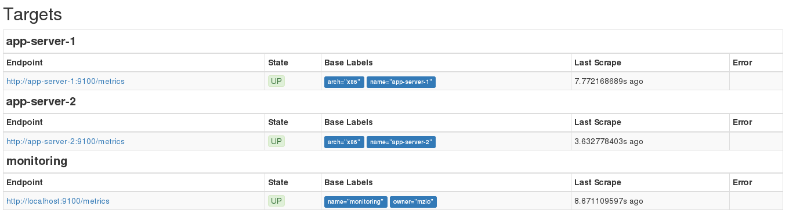
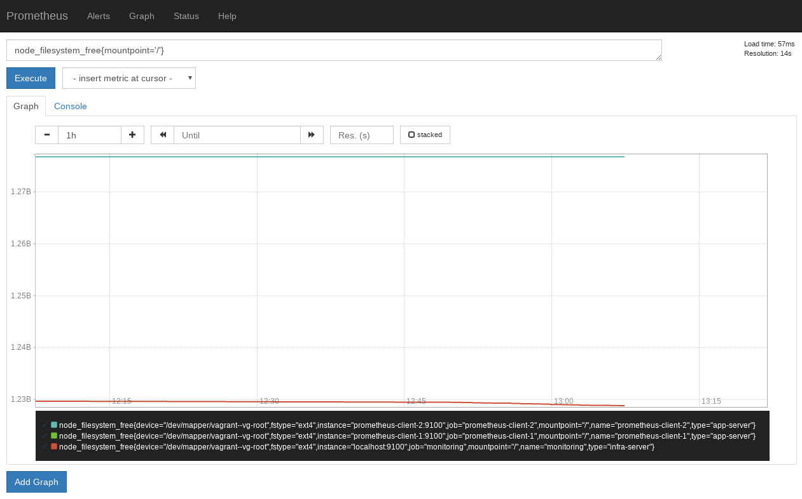

.. todo:: date, tags and title

.. post::
   :tags: monitoring
   :title: Monitoring with Prometheus

==========================
Monitoring with Prometheus
==========================

One of the worst calls you can get as developer, is one from the user
who complains that the service is slow or -- even worse -- doesn't
respond anymore. A user should **never know before you**, that your
service doesn't behave in its parameters anymore. One of the common
causes for service degradation or interruption is still the failure
or exhaustion of your basic infrastructure resources. This post gives you an
intro how you can monitor your basic resources with *Prometheus*. It shows
the setup with *Ansible* and the data visualization with *Grafana*.

.. contents::
    :local:
    :backlinks: top

.. todo:: date

.. list-table:: Change history:
   :widths: 1 5
   :header-rows: 1

   * - Date
     - Change description
   * - YYYY-MM-DD
     - The first release

Use Case
========

Monitoring is a way of collecting and storing data (so called *metrics*)
so that you can extrapolate a trend out of the historic view, to give
you insights if preemptive actions are necessary to keep your promised
*Service Level Agreements* (SLAs).

This post will focus on the monitoring aspect of the resources your
service can consume. Specifically I'll go into details of monitoring:

* CPU
* memory
* disk space

For example, if you don't use *logrotation*, it's easy to consume all
disk space and become unserviceable. A bug in the thread handling can
also lead to block CPU. And a good old memory leak is never out of fashion.

Setup Overview
==============

Our end result will look like this:

.. todo:: picture

* 3 nodes
  * 1 = monitoring server
  * 2 = application server

* application server will each have a mini app

Brain dump
==========

Save this file:

.. literalinclude:: Vagrantfile
   :caption: file: Vagrantfile :download:`(download) <Vagrantfile>`
   :name: vagrantfile
   :language: ruby
   :linenos:
   :emphasize-lines: 1

Do a ``vagrant up``.

This is how we configure the prometheus server:

.. literalinclude:: prometheus.yml
   :caption: file: prometheus.yml :download:`(download) <prometheus.yml>`
   :name: prometheus-config
   :language: yaml
   :linenos:
   :emphasize-lines: 1

.. important::
   In newer versions of Prometheus, ``target_groups`` got replaced by
   ``static_configs`` [promstatic]_ .

I'm going to use more and more
Ansible examples in this blog, as this is my tool of choice for such
tasks. Doing such things with the shell looks smaller and easier at first,
but the more nodes you have, the more *Ansible* comes in handy.

After this is done, we will use this hosts file for *Ansible*:

.. literalinclude:: hosts.ini
   :caption: file: hosts.ini :download:`(download) <hosts.ini>`
   :name: hostsfile
   :language: ini
   :linenos:
   :emphasize-lines: 1

.. warning::
  Don't store passwords like that when using *Ansible*. Use the
  *Ansible Vault* feature [ansivault]_ for that.

It's this *Ansible* playbook:

.. literalinclude:: playbook.yml
   :caption: file: playbook.yml :download:`(download) <playbook.yml>`
   :name: playbook
   :language: yaml
   :linenos:
   :emphasize-lines: 1
   :lines: 3-19

.. note::
   It's perfectly fine to start *Ansible* playbooks like I did here.
   For example, when you transition from shell scripts. At some point in
   time you should very strongly consider to encapsulated logic into
   *Ansible roles* [ansiroles]_.

Now execute the playbook locally (not in any of the VMs):

.. code-block:: bash
   :linenos:

   $ ansible-playbook -i hosts.ini playbook.yml

.. note:: It's possible to use Vagrant's Ansible provisioner directly
 in the Vagrantfile, but to have a more realistic scenario here,
 I separated these steps.

After the playbooks is executed
open the prometheus server UI at http://192.168.100.10:9090/status .
You should see that all the expected targets are listend and in state ``UP``
like in this image:

.. todo:: double-check the naming of the servers here, I might have renamed
   them at some point.

At http://192.168.100.10:9090/graph you can start using the Prometheus
query language [promq]_ to create graphs based on the metrics the
Prometheus server scrapes from the targets in an interval. For example,
you can query the available disk space from the nodes by using
``node_filesystem_free{mountpoint='/'}``:

* ``node_filesystem_free``: This is the metric you're interested in
* ``{mountpoint='/'}``: This is a constraint you can specify

You'll notice very quickly that this gets ugly. For example, the metric
is in bytes, and you cannot transform it to a human readable unit. Let's
use *Grafana* to visualize that in a sensible way.

The Ansible playbook also installed and configured the Grafana service,
which is accessible at http://192.168.100.10:3000/ .

Sign in as username ``admin`` and password ``admin``.

Conclusion
==========

This post showed how to monitor operating system metrics with
*Grafana*, *Prometheus* und *Prometheus Node Exporter*. The deployment
of the software happened with *Ansible*, after the server provisioning
was done with *Vagrant* and *VirtualBox*. We deployed the necessary
software by using the packaged versions from *Ubuntu*. Unfortunately,
it got decided that *Grafana* won't be in release *17.10* and newer [grafdrop]_.
This is a good chance to show in another post, how we can create
*Ansible Roles* to encapsulate the logic of getting the newest *Grafana*
source code, building it, and deploying it. This also enables us to
to make use of the much nicer API [grafds]_ and UI.

Those node metrics aren't the only metrics you can collect. There is a
variety of different exporters [promex]_ which help you to keep the overview.
You can also instrument your own application to emit metrics. That's something
I will show in another post.

References
==========

.. todo:: 
   make numbers out of these references and order them accordingly
   when the post is finalized.

.. [promstatic] https://github.com/prometheus/prometheus/issues/1706

.. [promq] https://prometheus.io/docs/querying/basics/

.. [ansivault] http://docs.ansible.com/ansible/latest/playbooks_vault.html

.. [grafds] http://docs.grafana.org/http_api/data_source/

.. [ansiroles] http://docs.ansible.com/ansible/latest/playbooks_reuse_roles.html

.. [grafdrop] https://answers.launchpad.net/ubuntu/+source/grafana/+question/658771

.. [promex] https://prometheus.io/docs/instrumenting/exporters/
