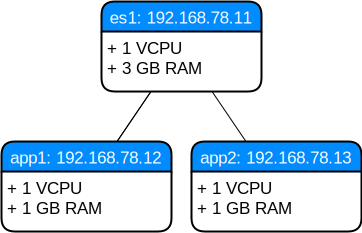

.. post::
   :tags: logging, elasticstack
   :category: monitoring
   :title: Elastic Stack (formerly ELK) - Elasticsearch

.. spelling::
   tokenized

.. |es| replace:: *Elasticsearch*

==============================================
Elastic Stack (formerly ELK) - *Elasticsearch*
==============================================

When something goes wrong in an environment, the people trying to fix it
mostly start by looking at the log files persisted on the local filesystem
of the server. This gets more cumbersome the more server and services
participate. Highly distributed applications, developed and deployed as
microservices in a cloud environment exacerbate this too. A centralized
logging server helps to ease the pain. In this post I'll talk about the
popular |es| service, which is part of the *Elastic Stack*, formerly known
as *ELK* stack.

.. contents::
    :local:
    :backlinks: top

.. list-table:: Change history:
   :widths: 1 5
   :header-rows: 1

   * - Date
     - Change description
   * - 2018-01-05
     - The first release

Intro
=====

This is the first part of a multi-part series about the
*Elastic Stack* (formerly the **ELK stack**). This stack
consists of 3 parts:

* **storing data** with |es|
* **ingesting data** with *Logstash* (and/or *Beats*)
* **visualizing data** with *Kibana*

This post will focus on the first part, |es|, which uses a schema-less,
flexible data model, often called **document based**. This means you
can use your current data as-is and don't have to transform
it into another schema so that |es| can deal with it.

This post will focus on the **log storage and query** part and
won't delve into metrics analytics or other use cases you can
implement with |es|. We will also not talk about the *x-pack* plugins,
which would add more functionality.

.. _sec-env:

Set up the environment
======================

To reproduce the steps in this post, you need to have installed locally:

* *Vagrant* [#vagrinst]_
* *Ansible* [#ansinst]_
* *VirtualBox* [#vbinst]_

After these **prerequisites** are fulfilled:

#. download the compressed
   :download:`project source files <elastic-stack-elk-elasticsearch.tar.gz>`.
#. extract the archive
#. change to the ``env`` directory
#. start the *Vagrant* setup
#. use *Ansible* to configure the environment

.. code-block:: bash
   :linenos:
   :emphasize-lines: 0

   $ wget http://www.markusz.io/_downloads/elastic-stack-elk-elasticsearch.tar.gz
   $ tar -zxvf elastic-stack-elk-elasticsearch.tar.gz
   $ cd env
   $ vagrant up
   $ ansible-playbook playbook.yml

Your (truncated) output should look similar to this:

.. code-block:: text
   :linenos:
   :emphasize-lines: 0

   [...]

   PLAY RECAP ********************************************************************
   app1                       : ok=10   changed=6    unreachable=0    failed=0
   app2                       : ok=10   changed=6    unreachable=0    failed=0
   es1                        : ok=21   changed=17   unreachable=0    failed=0

   Thursday 04 January 2018  16:29:04 +0100 (0:00:01.319)       0:02:06.741 ******
   ===============================================================================
   Install python package manager. ---------------------------------------- 50.79s
   Install JAVA runtime. -------------------------------------------------- 24.73s
   Check if Elasticsearch is up an running. ------------------------------- 11.50s
   Wait for SSH to be ready. ---------------------------------------------- 10.36s
   Download file with checksum check. -------------------------------------- 9.31s
   Install app requirements. ----------------------------------------------- 4.87s
   Ensure system package cache is updated. --------------------------------- 4.46s
   Unarchive the elasticsearch archive. ------------------------------------ 1.43s
   Run example app. -------------------------------------------------------- 1.32s
   Run elasticsearch as daemon. -------------------------------------------- 1.22s
   Add our servers to the hosts file. -------------------------------------- 0.99s
   Deploy example app to servers. ------------------------------------------ 0.88s
   Ping each other via DNS names. ------------------------------------------ 0.77s
   Gather some facts for later. -------------------------------------------- 0.62s
   Creating user for Elasticsearch group. ---------------------------------- 0.37s
   Create a group for Elasticsearch. --------------------------------------- 0.32s
   Disable all swapping. --------------------------------------------------- 0.32s
   Create logging directory. ----------------------------------------------- 0.31s
   Set maximum number of memory map areas (permanently). ------------------- 0.29s
   Set number of open file descriptors (permanently). ---------------------- 0.28s

.. note::

   After you decided that you don't need this environment anymore,
   you can remove it with ``vagrant destroy -f``

This created a **virtualized environment** which looks like this:

* one central logging server ``es1``
* two application servers ``app1`` and ``app2``
* *Ubuntu 16.04* as operating system
* Java *Open JDK* in version 8
* |es| in version 6.1

While the setup goes on for a minute or two, let's have a look at
a few basic terms and concepts of |es|.

.. _sec-concepts:

Terms and Concepts
==================

Let's start with an overview of the basic **concepts** [#concepts]_.
I'll explain the details after this image:

.. image:: images/elasticsearch-concepts-YfYunTY.svg
   :scale: 100 %
   :alt: The basic terms and concepts in |es|

The main entity we're interested in is the **Document**. This is the
schema-less entity we want to store in |es|. In our case, as this post
focuses on centralized logging, this is one single log entry.

|es| stores *Documents* in an **Index** and every *Index* can store multiple
*Documents*. The *Index* is the entity which provides the ability to search
*Document* objects.

Each |es| service is considered a **Node**. This *Node* is not necessarily
bound to one hardware server or virtual machine. Each *Node* is in other
words, an |es| instance. Each one can have 0 to N *Index* objects to
scale out the management of *Document* objects.

For further horizontal scale out, each *Node* can be part of a **Cluster**.
Each *Cluster* consists of 1 to N *Node* objects. A single-node setup is
still a *Cluster* (with only 1 *Node*). There are *master nodes* in a
cluster, which determine how information gets replicated, but I won't
dive into it in this post.

As described before, an *Index* is the (abstract) entity which stores
our documents. To be precise, an *Index* consists of **Shards**. These
*Shard* objects are *Index* objects themselves and can therefore store
*Documents*. This concept enables splitting out the *Documents* into
smaller segments. One *Shard* is in fact the *Lucene Index* [#lucene]_,
the search engine encapsulated by |es|. Such *shards* can be called
**primary shards**.

The *Shard* objects can be replicated (copied) into so called **Replica**
entities (or **replica shards**). A set of *Replica* objects are collected
in a **Replication Group**. Those *replica shards* enable
*High Availability (HA)* and *Data Recovery (DR)*. Hopefully I can
dive deeper into these capabilities in a later post.

After these basic terms and concepts are described, let's finally
interact with |es| in our environment.

Basic Interaction with |es|
===========================

After the setup by the *Ansible playbook*, we can interact with the
**REST API** of |es| via ``curl`` on our local machine. Port ``9200`` is
the default:

.. code-block:: bash
   :linenos:
   :emphasize-lines: 3,4,7,11

   $ curl 192.168.78.11:9200
   {
     "name" : "hMDFApt",
     "cluster_name" : "elasticsearch",
     "cluster_uuid" : "kEM4Oz-PQQ-98ZgdOxGOdw",
     "version" : {
       "number" : "6.1.1",
       "build_hash" : "bd92e7f",
       "build_date" : "2017-12-17T20:23:25.338Z",
       "build_snapshot" : false,
       "lucene_version" : "7.1.0",
       "minimum_wire_compatibility_version" : "5.6.0",
       "minimum_index_compatibility_version" : "5.0.0"
     },
     "tagline" : "You Know, for Search"
   }

This JSON response shows a few things of the previous section:

* ``name``: The name of the *Node*. I used the default, which randomly
  generates a unique one. This is configurable.
* ``cluster_name``: The name of the *Cluster* this *Node* is in.
  Again, I used the default name.
* ``number``: The version of the |es| *Node*.
* ``lucene_version``: The version of the search engine
  encapsulated by |es|.

The **REST API** has some useful **common options** [#commonapi]_:

* ``pretty=true``: to beautify the JSON output
* ``format=yaml``: use YAML instead of JSON as output
* ``error_trace=true`` to show a more verbose error trace
* ``filter_path=<values>`` to reduce the response

We will use some of these later.

Health Check
------------

Let's do a basic health check of our single-node cluster.
We use ``format=yaml`` to have an output which is easier to read:

.. code-block:: bash
   :linenos:
   :emphasize-lines: 0

   $ curl 192.168.78.11:9200/_cat/health?format=yaml

The output, formatted as YAML:

.. code-block:: bash
   :linenos:
   :emphasize-lines: 5

   ---
   - epoch: "1514998054"
     timestamp: "16:47:34"
     cluster: "elasticsearch"
     status: "green"
     node.total: "1"
     node.data: "1"
     shards: "0"
     pri: "0"
     relo: "0"
     init: "0"
     unassign: "0"
     pending_tasks: "0"
     max_task_wait_time: "-"
     active_shards_percent: "100.0%"

|es| uses a traffic light system with *green*, *yellow* and *red*.
As the ``status`` is ``green``, we're good, the node works fine.

List Nodes
----------

Any real live production system which uses |es| will most likely have
a cluster with multiple nodes in it. In those setups it might come
in handy to list all nodes:

.. code-block:: bash
   :linenos:
   :emphasize-lines: 3,11,12

   $ curl 192.168.78.11:9200/_cat/nodes?format=yaml

The output, formatted as YAML:

.. code-block:: yaml
   :linenos:
   :emphasize-lines: 2,10,11

   ---
   - ip: "192.168.78.11"
     heap.percent: "6"
     ram.percent: "63"
     cpu: "0"
     load_1m: "0.00"
     load_5m: "0.00"
     load_15m: "0.00"
     node.role: "mdi"
     master: "*"
     name: "hMDFApt"

Remember, we have a single-node system, so only this one should
get listed:

* ``ip``: as described in the previous section :ref:`sec-env`
* ``master``: this node is a *master node* in this *cluster*.
  I'll dive deeper into that in a later post.
* ``name``: the name of this *node*

If the cluster would contain more nodes, they would be shown here
with YAML list style (see *Block Sequence* at [#yamllist]_).

Minimal Example
---------------

Let's create a very small document:

.. code-block:: bash
   :linenos:
   :emphasize-lines: 0

    $ curl -X PUT '192.168.78.11:9200/my-index/my-type/1?pretty' \
    -H 'Content-Type: application/json' \
    -d '{
        "my_document" : "my document content"
    }'

This HTTP PUT call does multiple things:

* it creates an *Index* called ``my-index``
* it creates a *Type* in that *Index*, called ``my-type``
* it adds the *Document* (the JSON for parameter ``-d``) to that *Index*
* it assigns the ID ``1`` to that document
* it increments the version number of that created (or updated) *Document*
* it specifies, that the HTTP response should be ``pretty`` json

It becomes more clear when we look at the HTTP response:

.. code-block:: json
   :linenos:
   :emphasize-lines: 0

   {
     "_index" : "my-index",
     "_type" : "my-type",
     "_id" : "1",
     "_version" : 1,
     "result" : "created",
     "_shards" : {
       "total" : 2,
       "successful" : 1,
       "failed" : 0
     },
     "_seq_no" : 0,
     "_primary_term" : 1
   }

Before going into more detail, let's query this document with another
REST API call:

.. code-block:: bash
   :linenos:
   :emphasize-lines: 0

   $ curl -X GET '192.168.78.11:9200/my-index/my-type/1?pretty'

This call gives us this JSON response:

.. code-block:: json
   :linenos:
   :emphasize-lines: 8

   {
     "_index" : "my-index",
     "_type" : "my-type",
     "_id" : "1",
     "_version" : 1,
     "found" : true,
     "_source" : {
       "my_document" : "my document content"
     }
   }

These are the basic steps to store and retrieve documents in |es|.

.. note::

   For centralized logging, where log entries are considered immutable, the
   versioning support is rather uninteresting. In case you got curious,
   take a look at [#esversion]_.

It's also worth nothing that the **automatic index creation** can be
disabled if you see the need for it [#esindexdis]_. You're also allowed
to create your indices beforehand [#esindexcreate]_.

List Indices
------------

Now that we have an (automatically created) index, we can query it:

.. code-block:: bash
   :linenos:
   :emphasize-lines: 0

   $ curl -X GET 192.168.78.11:9200/_cat/indices?format=yaml

Again, we use the ``format=yaml`` simply to have a more readable output:

.. code-block:: yaml
   :linenos:
   :emphasize-lines: 4,6,7

   ---
   - health: "yellow"
     status: "open"
     index: "my-index"
     uuid: "u4WB1ztWT1GVXGOI0OoJnQ"
     pri: "5"
     rep: "1"
     docs.count: "1"
     docs.deleted: "0"
     store.size: "4.5kb"
     pri.store.size: "4.5kb"

This is the one *Index* we created automatically by adding a
document to it previously.
We also see the impact of *primary shards* and *replication shards*
in this response, namely the fields ``pri`` and ``rep``, as discussed
in the previous section :ref:`sec-concepts`.

Now that we know the basic interaction with |es|, let's use it as
a centralized logging server in the next section.

Logging to |es|
===============

The *Ansible playbook* also deploy a **small example application** to
the application servers ``app1`` and ``app2`` of our environment.
It's a *Python Flask* app [#flask]_ which uses Python's logging
library [#pylog]_. *Flask* enables us to create a REST API to interact
with the apps. The logging library gives us a means to write a custom
log handler which emits log records into |es|. Here's the code first,
then I explain the important parts:

.. literalinclude:: example-app/app.py
   :language: python
   :linenos:
   :emphasize-lines: 15,24,31-33,40,43,46,68-70,90

The class ``ElasticsearchHandler`` is a (very rudimentary) **logging handler**
which can be added to a logger. When the logger logs a record, the added
handlers can emit them to different targets. This class emits the log
record to our *node* on server ``es1``.

This custom logging handler is also responsible for putting together the
**payload** to send to |es|. We use the **requests** package to call
the REST API of |es|, like we did earlier with ``curl`` commands.

We use a ``Formatter`` for our log records.

We configure the logging handler with an |es| *Index* and *Type* by
specifying the URL ``/app/logs/``. This means, an *Index* ``app`` gets
automatically created if it doesn't exist yet.

As we don't want to rely on the centralized logging only, which might
suffer from intermittent network connectivity issues, we log into a
file on the local filesystem too. There will be a rotated log file
``app.log`` [#pylogrot]_ on each of the application servers.

After that, we define the URL routing for our REST API by using *Flask*
decorators. For example, we will have a route ``/logging/debug``,
which does nothing else but creating a log record with ``DEBUG``
log level and a rather useless message. It also returns a string we
will get as a response when calling our app's REST API.

At last, we run the app and let it listen on all network devices,
so it can be reached by the private IP addresses of the virtual machines.
The default port for that is ``5000``.

Interact with our app
---------------------

.. code-block:: bash
   :linenos:
   :emphasize-lines: 0

   $ curl -X GET 192.168.78.12:5000/
   Hello World!
   $ curl -X GET 192.168.78.12:5000/logging/debug
   Logged debug message.
   $ curl -X GET 192.168.78.12:5000/logging/info
   Logged info message.
   $ curl -X GET 192.168.78.12:5000/logging/warning
   Logged warning message
   $ curl -X GET 192.168.78.13:5000/logging/info  # app2 server
   Logged info message.

We used ``curl`` to call our app's REST API on port 5000 with the
routing we specified with *Flask*. If we did everything correct
there should be log files on the application servers:

.. code-block:: bash
   :linenos:
   :emphasize-lines: 0

   $ vagrant ssh app1 -c "cat /opt/example-app/app.log"
   2018-01-04 19:32:24,204 - __main__ - DEBUG - debug message
   2018-01-04 19:32:47,899 - __main__ - INFO - info message
   2018-01-04 19:32:51,147 - __main__ - WARNING - warning message
   Connection to 127.0.0.1 closed.
   $
   $ vagrant ssh app2 -c "cat /opt/example-app/app.log"
   2018-01-04 19:35:36,504 - __main__ - INFO - info message
   Connection to 127.0.0.1 closed.

We see that the log file has the format as we specified in the app.

Search our log entries
----------------------

Let's use our knowledge from the previous sections to check if there
is a new *Index* created:

.. code-block:: bash
   :linenos:
   :emphasize-lines: 0

   $ curl -X GET 192.168.78.11:9200/_cat/indices?format=yaml

.. code-block:: yaml
   :linenos:
   :emphasize-lines: 4,8

   ---
   - health: "yellow"
     status: "open"
     index: "app"
     uuid: "N6ORz3afRLWZxoogAjAYDQ"
     pri: "5"
     rep: "1"
     docs.count: "4"
     docs.deleted: "0"
     store.size: "24.3kb"
     pri.store.size: "24.3kb"
   - health: "yellow"
     status: "open"
     index: "my-index"
     uuid: "u4WB1ztWT1GVXGOI0OoJnQ"
     pri: "5"
     rep: "1"
     docs.count: "1"
     docs.deleted: "0"
     store.size: "4.6kb"
     pri.store.size: "4.6kb"

Yes, there is our **new index called app** and our four documents are
correctly counted as well.

In the minimal example in a previous chapter, we had the ID to query
the document. We didn't do that this time, as we don't want to bother
with managing IDs when dealing with log records. We did let |es| assign
IDs by itself. So we need to use the **search API** [#essearch]_:

.. code-block:: bash
   :linenos:
   :emphasize-lines: 0

   $ curl -X GET 192.168.78.11:9200/app/_search?pretty=true

.. code-block:: json
   :linenos:
   :emphasize-lines: 11,19,32,45,58

   {
     "took" : 60,
     "timed_out" : false,
     "_shards" : {
       "total" : 5,
       "successful" : 5,
       "skipped" : 0,
       "failed" : 0
     },
     "hits" : {
       "total" : 4,
       "max_score" : 1.0,
       "hits" : [
         {
           "_index" : "app",
           "_type" : "logs",
           "_id" : "Lc2rwmABVxyRMIKP804k",
           "_score" : 1.0,
           "_source" : {
             "timestamp" : "2018-01-04 19:35:36,504",
             "message" : "info message",
             "host" : "app2",
             "module" : "app",
             "level" : "INFO"
           }
         },
         {
           "_index" : "app",
           "_type" : "logs",
           "_id" : "K82pwmABVxyRMIKPYE5h",
           "_score" : 1.0,
           "_source" : {
             "timestamp" : "2018-01-04 19:32:47,899",
             "message" : "info message",
             "host" : "app1",
             "module" : "app",
             "level" : "INFO"
           }
         },
         {
           "_index" : "app",
           "_type" : "logs",
           "_id" : "LM2pwmABVxyRMIKPbU4P",
           "_score" : 1.0,
           "_source" : {
             "timestamp" : "2018-01-04 19:32:51,147",
             "message" : "warning message",
             "host" : "app1",
             "module" : "app",
             "level" : "WARNING"
           }
         },
         {
           "_index" : "app",
           "_type" : "logs",
           "_id" : "Ks2pwmABVxyRMIKPBE5J",
           "_score" : 1.0,
           "_source" : {
             "timestamp" : "2018-01-04 19:32:24,204",
             "message" : "debug message",
             "host" : "app1",
             "module" : "app",
             "level" : "DEBUG"
           }
         }
       ]
     }
   }

These are the four log records we sent as documents to |es| with the
help of your custom logging handler in our example app.

Summary
=======

We set up an environment with a single-node instance of |es|, a data
store for documents. In our case, we use it as **centralized logging store**.
We used an example application to show the interaction between application
logs and the storing and querying of log records.

Alternatives could be a centralized logging approach with
*rsyslog* [#rsyslog]_. I most likely won't do a comparison between
the two approaches.

The REST API of |es| can do much more than I showed here. For example:

* calculate the ``_score`` by providing ``match`` criteria
* use clauses with ``must``, ``must_not`` and ``should``
* create aggregations with ``aggs`` and ``avg``

For GUI dashboards, which show the current (and historic) state of
your environment, these REST APIs provide a lot of possibilities.
We will dive more in details when we talk about **Kibana**, the GUI
component of the *Elastic Stack*.

The next post in this series will talk about **Logstash**, which makes
our (shaky) custom logging handler obsolete.

References
==========

.. [#vagrinst] https://www.vagrantup.com/docs/installation/

.. [#ansinst] http://docs.ansible.com/ansible/latest/intro_installation.html

.. [#vbinst] https://www.virtualbox.org/wiki/Downloads

.. [#concepts] https://www.elastic.co/guide/en/elasticsearch/reference/6.1/_basic_concepts.html

.. [#lucene] https://lucene.apache.org/

.. [#commonapi] https://www.elastic.co/guide/en/elasticsearch/reference/6.1/common-options.html

.. [#yamllist] http://www.yaml.org/spec/1.2/spec.html#id2797382

.. [#esversion] https://www.elastic.co/guide/en/elasticsearch/reference/6.1/docs-index\_.html#index-versioning

.. [#esindexdis] https://www.elastic.co/guide/en/elasticsearch/reference/6.1/docs-index\_.html#index-creation

.. [#esindexcreate] https://www.elastic.co/guide/en/elasticsearch/reference/6.1/indices-create-index.html

.. [#flask] http://flask.pocoo.org/

.. [#pylog] https://docs.python.org/2/howto/logging.html#logging-basic-tutorial

.. [#pylogrot] https://docs.python.org/2/library/logging.handlers.html#logging.handlers.RotatingFileHandler

.. [#essearch] https://www.elastic.co/guide/en/elasticsearch/reference/current/search.html

.. [#rsyslog] http://www.rsyslog.com/
