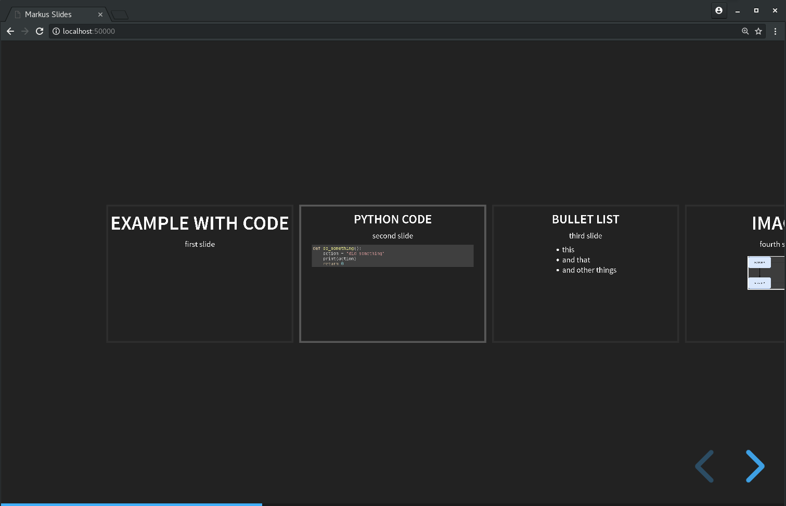

.. post:: Mar 16, 2018
   :tags: presentations, slides, docker
   :title: HTML5 slides with Reveal.js, Markdown and Docker

.. spelling::
   foo

.. |rs| replace:: *Reveal.js*
.. |md| replace:: *Markdown*

======================================================
HTML5 slides with *Reveal.js*, *Markdown* and *Docker*
======================================================

Presentation slides. They can be a great tool for communicating ideas
to others. I was looking for a way to create slide decks where I can
specify the content as plain text and have it separate to the rendering.
I'm sure this is somehow possible with *PowerPoint* or *OpenOffice*,
but I didn't bother to look for it. This post shows how I specify the
content in a *Markdown* file and let it render by *Reveal.js* which
I packed into a *Docker* image.

.. contents::
    :local:
    :backlinks: top

.. list-table:: Change history:
   :widths: 1 5
   :header-rows: 1

   * - Date
     - Change description
   * - 2018-03-16
     - The first release
   * - 2018-03-16
     - Fixed wording for "3 highlighted empty lines" and a reference.

Encapsulate *Reveal.js* with *Docker*
=====================================

|rs| is capable of using |md| files [#revmd]_ and render them as HTML5
slides. The downside of |rs| is, that it needs a lot of things installed
to work and I didn't want to have that on my laptop simply to show
fancy slides. So I decided to encapsulate it with *Docker*.

Create a file named ``Dockerfile`` to specify the image's content:

.. literalinclude:: docker/Dockerfile
   :language: docker
   :linenos:
   :emphasize-lines: 0

``nodejs`` |rs| is a *node.js* application, that's why we need it.
If you don't install ``nodejs-legacy``, you'll see this error message:

.. code-block:: bash
   :linenos:

   [...]
   sh: 1: node: not found
   [...]
   npm ERR! Linux 3.10.0-693.17.1.el7.x86_64
   npm ERR! argv "/usr/bin/nodejs" "/usr/bin/npm" "install"
   npm ERR! node v4.2.6
   npm ERR! npm  v3.5.2
   npm ERR! file sh
   npm ERR! code ELIFECYCLE
   npm ERR! errno ENOENT
   npm ERR! syscall spawn

   npm ERR! node-sass@4.7.2 install: `node scripts/install.js`
   npm ERR! spawn ENOENT
   npm ERR!
   npm ERR! Failed at the node-sass@4.7.2 install script 'node scripts/install.js'.
   npm ERR! Make sure you have the latest version of node.js and npm installed.

``npm`` is the package manager for *node.js* applications, which is needed
so that the dependencies of |rs| get installed. The ``index.html`` file
gets explained in the next section. The ``ENTRYPOINT`` starts the web server
of |rs| when a container based on that image is started.

The slide deck main page
========================

Create the file ``index.html``, which will be used by
*reveal.js* to serve when the HTTP server starts:

.. literalinclude:: docker/index.html
   :language: html
   :linenos:
   :emphasize-lines: 7,27-32

I basically copied the ``index.html`` which comes with |rs| and changed
only the highlighted lines.

.. note::

   Please note that the links are URIs and not operating system file paths.

In detail:

* ``data-markdown="content/index.md`` specifies the path to the *Markdown*
  file. This will become important later when we start the container and
  do a bind mount from the host file system.
* ``data-separator="^\n\n\n"`` tells |rs| to interpret 3 empty lines in
  the ``index.md`` content file as the beginning of a new slide.
* ``data-separator-vertical="^\n\n"`` creates a new **vertical slide**,
  which is a nice feature of |rs|, which, for example, let's you add
  backup slides closer to the content.
* ``data-separator-notes="^Note:"`` let's you add **speaker notes** which
  get shown in a separate browser window when opened.
* ``data-charset="iso-8859-15"`` make it work for Western European
  languages.

Let's create the content linked to with ``content/index.md`` in the next
section.

Specify the content in *Markdown*
=================================

Create the file ``index.md`` which specifies our content:

.. literalinclude:: slides/topic-about-this/index.md
   :language: text
   :linenos:
   :emphasize-lines: 4-6,18-19,37

As specified with ``^\n\n\n"``, 3 empty lines signal
the beginning of a new slide. The speaker notes get added with ``Note:``.
The last highlighted lines links to an image. This example image
``example.drawio.svg`` (not shown in this post) is locally in the
very same directory where ``example.md`` resides in. The link begins
with ``content/`` though, because this the bind mount directory I
will declare when running the container later.

Build the *Docker* image
========================

We have the *Dockerfile* and all things which need to be part of the image
specified, now we need to build the image.

Create the file ``build.sh`` to build the image. This needs to be executed
in the same directory as the *Dockerfile*:

.. literalinclude:: docker/build.sh
   :language: bash
   :linenos:
   :emphasize-lines: 0

I tagged the image with ``markus:revealjs`` to reference it easier later on.

Build the image with:

.. code-block:: bash
   :linenos:

   $ ./build.sh

.. note::

   You don't need to save those commands in bash scripts like I did here.
   It's simply a thing I do when I have a hard time to remember the
   exact CLI command. It's other benefit is, that I can commit that file
   into *git* (or any other VCS).

Run the container with a bind mount
===================================

Create the file ``run.sh`` to run the *Docker* container. The different
options are explained below this:

.. literalinclude:: docker/run.sh
   :language: bash
   :linenos:
   :emphasize-lines: 0

* ``docker run``: run a *Docker* image.
* ``-d``: let it run in the background as a daemon. I had trouble exiting
  the process when running it as foreground process, that's why I let it
  run in the background.
* ``-v $(pwd):/reveal.js/content:Z``: do a **bind mount** of the current
  directory on the host (``$(pwd)``) to the directory ``/reveal.js/content``
  within the running container and consider the *SELinux* context (``Z``)
  so that |rs| is allowed to read the files in that directory.
* ``-p 50000:8000``: use the container's exposed port ``8000`` and bind it
  the the hosts port ``50000`` (I've arbitrarily chosen).
* ``--name slides``: gives the container the name ``slides``, which makes
  it easier to reference to.
* ``markus:revealjs``: use the image with that tag (we've set when
  building the image in the previous section).

Run the container and watch your slides with:

.. code-block:: bash
   :linenos:

   $ ./run.sh
   $ google-chrome localhost:50000

This will open the ``index.html`` which renders your *Markdown* content
with |rs|. The slide overview is opened with :kbd:`Esc`.

Clean up the container
======================

After everyone is thoroughly impressed by your slides, the
container needs to be stopped and removed.

Create the file ``clean.sh`` which helps with the cleanup:

.. literalinclude:: docker/clean.sh
   :language: bash
   :linenos:
   :emphasize-lines: 0

We use the name ``slides`` we specified when starting the container in
the previous section.

Start the cleanup with:

.. code-block:: bash
   :linenos:

   $ ./clean.sh

Re-use the container for different presentations
================================================

My initial thought was to re-use this container for different presentations
where I only need to store the content in different files, all named
``index.md`` but in different directories. My local directory structure
looks like this:

.. code-block:: text
   :linenos:

   $ tree
   .
   |-- docker
   |   |-- build.sh
   |   |-- clean.sh
   |   |-- Dockerfile
   |   |-- index.html
   |   `-- run.sh
   `-- slides
       |-- topic-about-that
       |   |-- index.md
       |   `-- run.sh
       `-- topic-about-this
           |-- example.drawio.svg
           |-- index.md
           `-- run.sh

Depending on which presentation I want to show, I switch into that
directory and call ``./run.sh`` to let the bind mount of *Docker*
make the ``index.md`` available inside the container.

Conclusion & Outlook
====================

The way I encapsulated |rs| here in a *Docker* container lets me
use it without polluting my local laptop with things I rarely need.

The image I created is big (~700MB), which doesn't cause any trouble
because I have enough disk space, but I was still wondering if I could
get that smaller with an *alpine* [#alpine]_ or *nodejs* [#imgnojs]_ base
image instead of the *ubuntu* image.

To be honest, my initial goal was to have static HTML generated, which
I can push to *github pages* or something similar. I couldn't figure out
if this was possible with |rs|.

The beautiful transitions between the slides only keep being beautiful
if there is no lag, like in some screen sharing solutions. I'm going to
use it in a face-to-face meeting in the next weeks (without any screen
sharing), maybe it will work well for me in that scenario.

References
==========

.. [#revmd] https://github.com/hakimel/reveal.js#markdown

.. [#alpine] https://hub.docker.com/_/alpine/

.. [#imgnojs] https://hub.docker.com/r/readytalk/nodejs/
