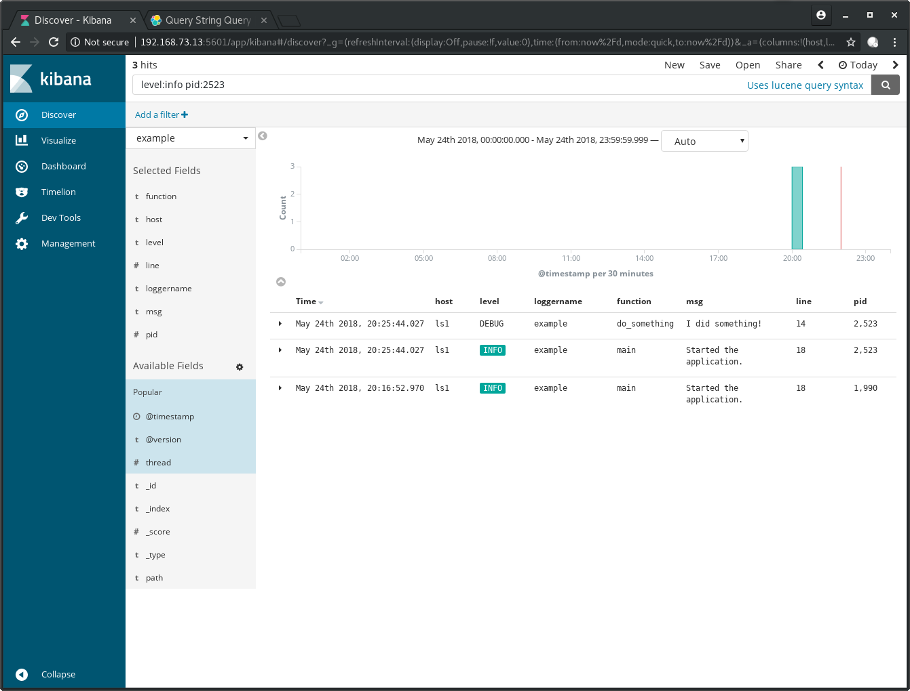

.. post::
   :tags: logging, elasticstack
   :category: monitoring
   :title: Elastic Stack (formerly ELK) - Kibana (part 1)

.. spelling::
   foo

.. |es| replace:: *Elasticsearch*
.. |ls| replace:: *Logstash*
.. |fb| replace:: *Filebeat*
.. |ki| replace:: *Kibana*

================================================
Elastic Stack (formerly ELK) - *Kibana* (part 1)
================================================

|ki| is the web UI to visualize data in the data store called |es|.
It's the user facing component in the *Elastic Stack*, formerly called
ELK stack. This post is based on previous posts which show the basics
of |ls| and |es| and will talk about a few ways how |ki| can help you
make sense out of your logs.

.. contents::
    :local:
    :backlinks: top

.. list-table:: Change history:
   :widths: 1 5
   :header-rows: 1

   * - Date
     - Change description
   * - 2018-05-25
     - The first release

Intro
=====

This is the fourth part of a series about the *Elastic Stack*. As said
at the beginning |ki| [#kibinst]_ is on top of |es| and |ls|.
To get the most out of this post, it's advisable to read the previous posts
in this series:

#. :ref:`elastic-stack-elk-elasticsearch`
#. :ref:`elastic-stack-elk-logstash-part1`
#. :ref:`elastic-stack-elk-logstash-part2`

If you already know that content, here we go.

A short recap
=============

The environment I've build for this post, consists of 3 virtual machines:

* ``es1`` as host of the |es| service
* ``ls1`` as host of the |ls| service and the example application
* ``kb1`` as host of the |ki| service

.. note::

   One virtual machine would have been good enough for demo purposes.
   I've chosen to use 3, because I wanted to know how tricky the
   configuration of the remote connection to the depending services will
   be. It turns out, it's fairly easy.

The example application looks like this:

.. literalinclude:: example-app/example.py
   :language: python
   :linenos:
   :emphasize-lines: 4,9,14,18

The log entries created by this example app will be processed by
|ls| and dissected into smaller parts by this pipeline configuration:

.. literalinclude:: env/logstash.conf
   :language: text
   :linenos:
   :emphasize-lines: 4,13,32

The |es| *Index* ``example`` here is the one we will use in |ki| later.

Set up the environment
======================

To reproduce the steps in this post, you need to have installed locally:

* *Vagrant* [#vagrinst]_
* *VirtualBox* [#vbinst]_

After these **prerequisites** are fulfilled:

#. download the compressed
   :download:`project source files <elastic-stack-elk-kibana-part1.tar.gz>`.
#. extract the archive
#. change to the ``env`` directory
#. start the *Vagrant* setup

.. code-block:: console
   :linenos:
   :emphasize-lines: 0

   $ wget http://www.markusz.io/_downloads/elastic-stack-elk-kibana-part1.tar.gz
   $ tar -zxvf elastic-stack-elk-kibana-part1.tar.gz
   $ cd env
   $ vagrant up  # does also all of the installation

.. note::

   After you decided that you don't need this environment anymore,
   you can remove it with ``vagrant destroy -f``

After this is fully done, all services are up and running, and
the example application got executed once, so that we have some
data to query.

Set up the index
================

Open your browser and point it to ``http://192.168.73.13:5601`` and you
should be greeted with this:

.. image:: images/kibana_1_start.png
   :width: 95%
   :alt: Welcome screen.

Click the button :guilabel:`Set up index patterns` in the top right corner,
to make |ki| aware of the index ``example`` we created in |es| during the
setup of the environment.

Enter ``example`` in the text field below :guilabel:`Index pattern`:

.. image:: images/kibana_2_index.png
   :width: 95%
   :alt: Set up index pattern.

After a click on :guilabel:`Next step` you need to chose the
``@timestamp`` filed for :guilabel:`Time Filter field name`:

After a click on :guilabel:`Create index pattern` you have the option
to do some fine tuning:

We will ignore that in this post. It's worth mentioning though, that
the data types we specified in the |ls| pipeline before gets recognized
here. See at the field ``line`` for example, which is a number and not
a string.

Discover your data
==================

After the index is setup, we can start to query our logs.
Click on :guilabel:`Discover` on the left panel and adjust the
time range on the top right to :guilabel:`Today`:

.. note::

   I've created more log entries by logging into the server with
   ``vagrant ssh ls1`` and executing the example application with
   ``/opt/example-app/example.py``, that's why I have more entries
   here in this screen.

Go to the left hand side, below :guilabel:`Available Fields` and click on
the :guilabel:`add` button which appears when you hover with your cursor
above the fields:

#. :guilabel:`host`
#. :guilabel:`level`
#. :guilabel:`loggername`
#. :guilabel:`function`
#. :guilabel:`msg`
#. :guilabel:`line`
#. :guilabel:`pid`

Let's use the *Lucene query syntax* [#lucene]_ to do some searches.

.. important::

   Be aware that the **default operator** of the *Lucene query syntax*
   is the **OR operator**. I was confused at first, because I thought
   it was the AND operator.

Enter ``level:info pid:2523`` into the search bar and hit the search button
and you will see that these terms get joined with OR:

Add the plus symbol in front of the field name to specify that it must
be in the result set. Enter ``+level:info pid:2523`` and search again:

.. image:: images/kibana_8_must.png
   :width: 95%
   :alt: Must have fields with the plus sign.

Wildcard searches are possible too. Use the query
``+host:ls* +function:do_something`` to search for logs of all hosts
which start with the name ``ls``:

A search with ranges can also be done. Search with
``line:[10 TO 15]`` for all log entries which are created in the
code between lines 10 to 15:

.. image:: images/kibana_10_range.png
   :width: 95%
   :alt: Range search.

These are fairly simple examples to help understand the basic idea
behind it.
A more realistic data source to practice with can be found at [#opstls]_
which contains all logs from the continuous integration tooling of the
*OpenStack* community.

Summary and outlook
===================

This post showed how to set up |ki| on an existing |es| data store to
search for log entries an example application was producing. A few
example queries with the *Lucene search query* showed how you can
build search terms to find the log entries most important to you.
The information how to setup these services can be found in the
:download:`project source files <elastic-stack-elk-kibana-part1.tar.gz>`.

What I didn't show here, and which will be the content of part 2 in
a follow-up post, are:

* ways to save your queries,
* create visualizations and dashboards in the UI
* store them in your code repository of choice.

References
==========

.. [#kibinst] https://www.elastic.co/guide/en/kibana/6.2/index.html

.. [#vagrinst] https://www.vagrantup.com/docs/installation/

.. [#vbinst] https://www.virtualbox.org/wiki/Downloads

.. [#lucene] https://www.elastic.co/guide/en/elasticsearch/reference/6.x/query-dsl-query-string-query.html#query-string-syntax

.. [#opstls] http://logstash.openstack.org/