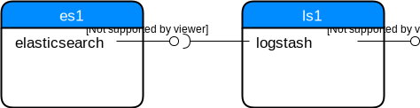

.. post::
   :tags: logging, elasticstack
   :category: monitoring
   :title: Elastic Stack (formerly ELK) - Logstash

.. spelling::
   tokenized

.. |es| replace:: *Elasticsearch*
.. |ls| replace:: *Logstash*

=========================================
Elastic Stack (formerly ELK) - *Logstash*
=========================================

.. contents::
    :local:
    :backlinks: top

.. list-table:: Change history:
   :widths: 1 5
   :header-rows: 1

   * - Date
     - Change description
   * - TODO
     - The first release

Intro
=====

This is the second part of a multi-part series about the
*Elastic Stack* (formerly known as the **ELK stack**). This stack
consists of 3 parts:

* **storing data** with |es|
* **ingesting data** with |ls| (and/or *Beats*)
* **visualizing data** with *Kibana*

This post will focus on the second part, |ls|. |ls| uses |es| as
storage back-end in this post, so you might want to read the previous
post about it at :ref:`elastic-stack-elk-elasticsearch`.

.. todo:: drop all traces of *ElasticSearch* in this post, I didn't use it.

I'll use a **virtualized environment** which looks like this:

* Server ``es1`` contains the |es| service which provides a REST API
  at port ``9200``.
* Server ``ls1`` contains the |ls| service which provides a REST API
  at port ``9600``. The |ls| service will use the REST API of |es|
  to store the logs.

Skip the next section if you don't want to repeat the steps locally.

Set up the environment
======================

To reproduce the steps in this post, you need to have installed locally:

* *Vagrant* [#vagrinst]_
* *Ansible* [#ansinst]_
* *VirtualBox* [#vbinst]_

After these **prerequisites** are fulfilled:

#. download the compressed
   :download:`project source files <elastic-stack-elk-logstash.tar.gz>`.
#. extract the archive
#. change to the ``env`` directory
#. start the *Vagrant* setup

.. code-block:: bash
   :linenos:
   :emphasize-lines: 0

   $ wget http://www.markusz.io/_downloads/elastic-stack-elk-logstash.tar.gz
   $ tar -zxvf elastic-stack-elk-logstash.tar.gz
   $ cd env
   $ vagrant up  # does also all of the installation

After this is fully done, you can access these two servers with:

.. code-block:: bash
   :linenos:
   :emphasize-lines: 0

   $ vagrant ssh es1     # log into the elasticsearch server
   [vagrant@es1] $ exit  # log out
   $ vagrant ssh ls1     # log into the logstash server
   [vagrant@ls1] $ exit  # log out

.. note::

   After you decided that you don't need this environment anymore,
   you can remove it with ``vagrant destroy -f``

While the setup goes on for a minute or two, let's have a look at
a few basic terms and concepts of |ls|.

Terms and Concepts
==================

|ls| has a concept of **pipelines**. It reads data from a source, optionally
transforms and/or filters out the data and writes the data to a data sink.
The pipelines are configured with these three steps

#. the ``input`` step
#. the ``filter`` step
#. the ``output`` step

This allows to have **multiple pipelines** in parallel, or let the output
from one pipelines be the input for another pipeline. It's the very same
idea like in a shell.

Every atomic input such a pipeline can read is called an **event**.
The ``filter`` step can transform such events to a different format
or even filter out some events. This makes |ls| very flexible and you
can adjust it to your data.

The steps described above are implemented as *plugins*. There are many
input plugins [#lsin]_, filter plugins [#lsfil]_ and output
plugins [#lsout]_. Let's see in the next section what we can do
with these plugins and how to specify a pipeline.

Pipeline Configuration
======================

The pipelines get configured with a custom grammar which resembles *Ruby*
a little, but it isn't. The description of the syntax is at [#config]_.
For our first pipeline, create a file
``/etc/logstash/conf.d/logstash-simple.conf`` with this content:

.. code-block:: text
   :linenos:
   :emphasize-lines: 0

   input {
     file {
       id => "my-app1-id-in"
       path => "/var/log/app1/source.log"
     }
   }

   output {
     file {
       id => "my-app1-id-out"
       path => "/var/log/app1/target.log"
     }
   }

This file gets read because |ls| uses the often seen ``conf.d``
concept:

.. code-block:: bash
   :linenos:
   :emphasize-lines: 6

   $ cat /etc/logstash/pipelines.yml
   # This file is where you define your pipelines. You can define multiple.
   # For more information on multiple pipelines, see the documentation:
   #   https://www.elastic.co/guide/en/logstash/current/multiple-pipelines.html

   - pipeline.id: main
     path.config: "/etc/logstash/conf.d/*.conf"

This example is rather useless in a real-live setup, but shows well the
structure and how to use one of the many input and output plugins.
I deliberately left out the (optional) filter plugin, to keep the
example simple.

What's happening here is:

* we use the ``file`` input plugin [#filein]_
* we gave that one usage of that plugin the ID ``my-app1-id-in``
* we specified that this input plugin should listen on changes for
  file ``/var/log/app1/source.log``
* we configured the ``file`` output plugin similarly [#fileout]_

Let's use this pipeline with some dummy data:

.. code-block:: bash
   :linenos:
   :emphasize-lines: 0

   $ vagrant ssh ls1  # to log into the local Logstash server
   $ echo $(date -Is) >> /var/log/app1/source.log

Execute this last line a few times and take a look at what the |ls|
pipeline has output into the target file.

.. tip::

   The ``jq`` CLI is very useful to show that JSON output.

Execute ``cat /var/log/app1/target.log | jq``:

.. code-block:: json
   :linenos:
   :emphasize-lines: 0

   {
     "@version": "1",
     "message": "2018-02-14T18:24:19+00:00",
     "@timestamp": "2018-02-14T18:24:21.364Z",
     "path": "/var/log/app1/source.log",
     "host": "ls1"
   }
   {
     "@version": "1",
     "message": "2018-02-14T18:24:33+00:00",
     "@timestamp": "2018-02-14T18:24:34.414Z",
     "path": "/var/log/app1/source.log",
     "host": "ls1"
   }
   {
     "@version": "1",
     "message": "2018-02-14T18:24:36+00:00",
     "@timestamp": "2018-02-14T18:24:37.491Z",
     "path": "/var/log/app1/source.log",
     "host": "ls1"
   }

As a comparison, this is our source file:

.. code-block:: bash
   :linenos:
   :emphasize-lines: 0

   $ cat /var/log/app1/source.log
   2018-02-14T18:24:19+00:00
   2018-02-14T18:24:33+00:00
   2018-02-14T18:24:36+00:00

A few interesting observations with this small example:

* |ls| encapsulates the message we created into a JSON object and adds
  meta data like a timestamp, the host and the version
* there is a small delay between our message creation and the
  timestamp which |ls| adds itself

When working with those pipelines and events, it may become useful
to get some insights into |ls| itself.

Basic interaction with |ls|
===========================

As shown in the beginning, |ls| has a REST API to get some stats
from it. This is useful to get some insights, for example if your
configured pipelines are recognized and how many events they processed.

For this, |ls| needs to bind to an IP address you can reach from outside
the server. In my virtual environment, I have this setting
in the file ``/etc/logstash/logstash.yml``:

.. code-block:: yml
   :linenos:
   :emphasize-lines: 0

   # ------------ Metrics Settings --------------
   # Bind address for the metrics REST endpoint
   http.host: "192.168.73.12"

To make the following queries a bit easier to read, export the URI of
the |ls| server as variable.

.. code-block:: bash
   :linenos:
   :emphasize-lines: 0

   $ export ls1="http://192.168.73.12:9600"

Let's do some queries.

**Request details about the Logstash instance:**

.. code-block:: bash
   :linenos:
   :emphasize-lines: 0

   $ curl "$ls1/?pretty"

.. note::

   During my experiments, the REST API didn't come up if not
   at least one pipeline was defined. Not sure if this is a bug
   or a feature. The next section will tell more about pipeline
   definitions.

Response:

.. code-block:: json
   :linenos:
   :emphasize-lines: 0

   {
     "host" : "ls1",
     "version" : "6.2.1",
     "http_address" : "192.168.73.12:9600",
     "id" : "b961f021-8470-48ad-ba6c-a4f1ca4ca5f1",
     "name" : "ls1",
     "build_date" : "2018-02-07T21:17:29+00:00",
     "build_sha" : "2b141ed331d8372b0cdd01fd1caad330ecc77df6",
     "build_snapshot" : false
   }

You'll notice that we're on host ``ls1`` as described in the environment
section from the beginning of this post, and that we use |ls| in version
``6.2``. This request helps to figure out if the instance is running.

**Request details about the pipelines:**

.. code-block:: bash
   :linenos:
   :emphasize-lines: 0

   $ curl "$ls1/_node/pipelines?pretty"

Response:

.. code-block:: json
   :linenos:
   :emphasize-lines: 8

   {
     "host" : "ls1",
     "version" : "6.2.1",
     "http_address" : "192.168.73.12:9600",
     "id" : "b961f021-8470-48ad-ba6c-a4f1ca4ca5f1",
     "name" : "ls1",
     "pipelines" : {
       "main" : {
         "workers" : 4,
         "batch_size" : 125,
         "batch_delay" : 50,
         "config_reload_automatic" : false,
         "config_reload_interval" : 3000000000,
         "dead_letter_queue_enabled" : false
       }
     }
   }

There is one pipeline configured, named ``main``. The configuration
will be shown in the next section. To be honest, I have no clue yet
what the other key-value-pairs in that dictionary mean. My assumption
is, that in high-availability setups, these things get important,
but ignore them for now.

**Request metrics about the events:**

.. code-block:: bash
   :linenos:
   :emphasize-lines: 0

   $ curl "$ls1/_node/stats/events?pretty"

Response:

.. code-block:: json
   :linenos:
   :emphasize-lines: 8-10

   {
     "host" : "ls1",
     "version" : "6.2.1",
     "http_address" : "192.168.73.12:9600",
     "id" : "b961f021-8470-48ad-ba6c-a4f1ca4ca5f1",
     "name" : "ls1",
     "events" : {
       "in" : 3,
       "filtered" : 3,
       "out" : 3,
       "duration_in_millis" : 99,
       "queue_push_duration_in_millis" : 0
     }
   }

This shows well how the processing of |ls| is based on *events*.
Also, the pipeline steps from above can be found here. The three
events I created above are reflected here too.

**Request metrics about the pipeline named** ``main``:

.. code-block:: bash
   :linenos:
   :emphasize-lines: 0

   $ curl "$ls1/_node/stats/pipelines/main?pretty"

Response:

.. code-block:: json
   :linenos:
   :emphasize-lines: 18,23,27,33

   {
     "host" : "ls1",
     "version" : "6.2.1",
     "http_address" : "192.168.73.12:9600",
     "id" : "b961f021-8470-48ad-ba6c-a4f1ca4ca5f1",
     "name" : "ls1",
     "pipelines" : {
       "main" : {
         "events" : {
           "duration_in_millis" : 99,
           "in" : 3,
           "out" : 3,
           "filtered" : 3,
           "queue_push_duration_in_millis" : 0
         },
         "plugins" : {
           "inputs" : [ {
             "id" : "my-app1-id-in",
             "events" : {
               "out" : 3,
               "queue_push_duration_in_millis" : 0
             },
             "name" : "file"
           } ],
           "filters" : [ ],
           "outputs" : [ {
             "id" : "my-app1-id-out",
             "events" : {
               "duration_in_millis" : 93,
               "in" : 3,
               "out" : 3
             },
             "name" : "file"
           } ]
         },
         "reloads" : {
           "last_error" : null,
           "successes" : 0,
           "last_success_timestamp" : null,
           "last_failure_timestamp" : null,
           "failures" : 0
         },
         "queue" : {
           "type" : "memory"
         }
       }
     }
   }

This shows the IDs we specified earlier and what type of plugin for
input and output we used. The next section will use a filter plugin
and show some of the capabilities.

Summary
=======

To keep this post at an digestible size, I make a cut here and will focus
in a follow up post more on the filter plugins and more realistic input
and how to connect to |es| as a data store.

This post showed a brief overview of the basics, which is simply necessary
to dive deeper into the great possibilities |ls| offers. We've seen
the pipeline concept and that events get encapsulated into JSON objects.
The metrics REST API of |ls| provides observability.

One thing I didn't talk about, but you should be aware of when you
consider to use |ls| in a productive environment, is the fact that there
are *in-memory queues* and *persistent queues* and you need to make a
decision what fits your requirements best [#queue]_. Unfortunately I have
too little real-live knowledge to give a recommendation here.

References
==========

.. [#vagrinst] https://www.vagrantup.com/docs/installation/

.. [#ansinst] http://docs.ansible.com/ansible/latest/intro_installation.html

.. [#vbinst] https://www.virtualbox.org/wiki/Downloads

.. [#lsin] https://www.elastic.co/guide/en/logstash/6.2/input-plugins.html

.. [#lsfil] https://www.elastic.co/guide/en/logstash/6.2/filter-plugins.html

.. [#lsout] https://www.elastic.co/guide/en/logstash/6.2/output-plugins.html

.. [#config] https://www.elastic.co/guide/en/logstash/6.2/configuration-file-structure.html

.. [#filein] https://www.elastic.co/guide/en/logstash/6.2/plugins-inputs-file.html

.. [#fileout] https://www.elastic.co/guide/en/logstash/6.2/plugins-outputs-file.html

.. [#queue] https://www.elastic.co/guide/en/logstash/6.2/persistent-queues.html
