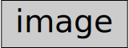
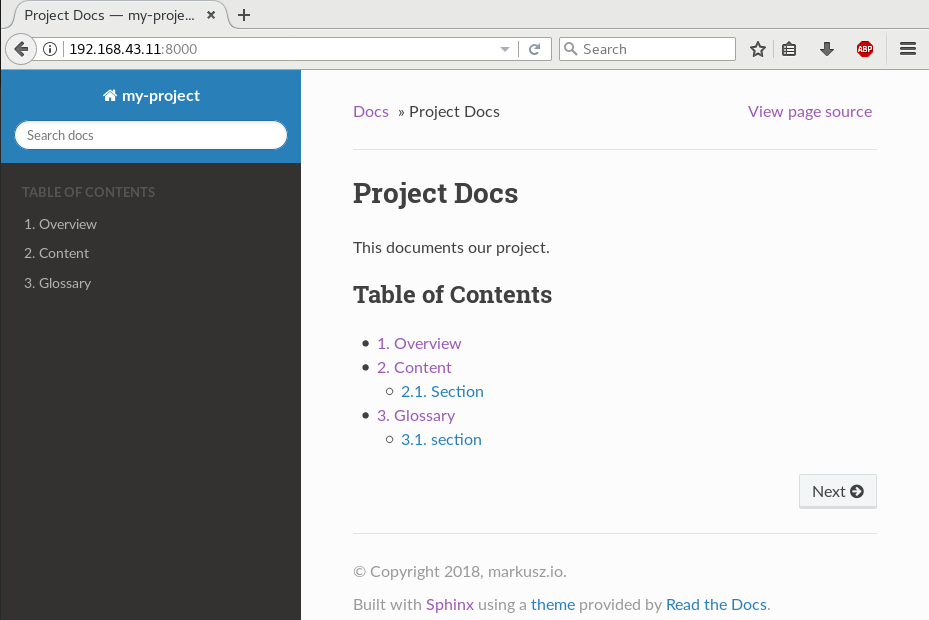
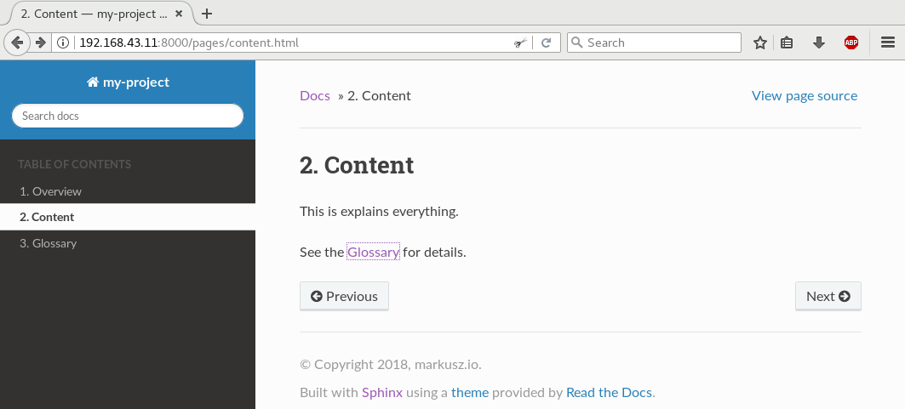
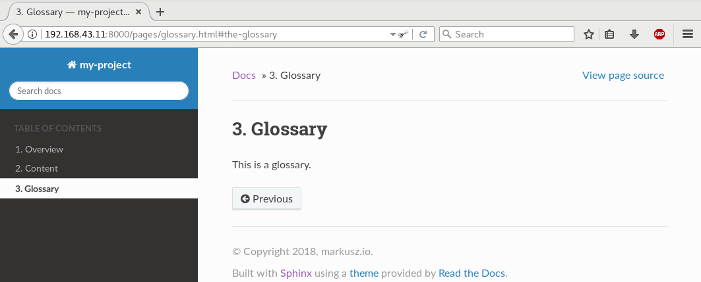
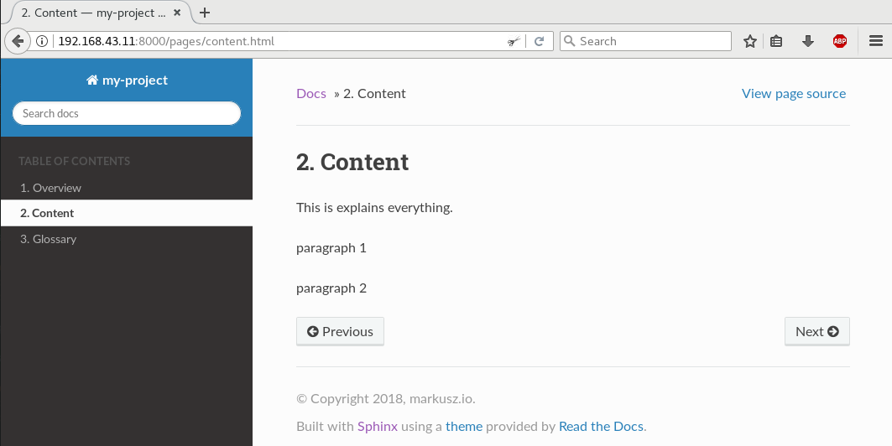

.. post::
   :tags: documentation, restructured-text, sphinx
   :title: Project documentation with restructured text and Sphinx

.. spelling::
   foo

===========================================================
Project documentation with *restructured text* and *Sphinx*
===========================================================

When it comes to documenting your project, especially the non-code parts,
you might face a plethora of opinions what the "correct approach" might be.
Some love *Word* documents, some favor *PowerPoint* slides and some like
documents written in a markup language. I'm one of the latter. This post
will show my favorite, *restructured text* with *Sphinx*. It will list the
features I usually need when documenting, and how to do it.

.. contents::
    :local:
    :backlinks: top

.. todo:: date of the change history

.. list-table:: Change history:
   :widths: 1 5
   :header-rows: 1

   * - Date
     - Change description
   * - 2017-11-02
     - The first release

Use Case
========

The benefit of using a markup
languages is, that you can treat your documentation like your code and
review and discuss it before publishing it.

Runs on all platforms (Windows, Linux, Mac)

Transform to multiple output formats (HTML, PDF, ...)

Minimal example
===============

We need two files:

* One file ``conf.py``, which will configure *Sphinx*.
* Another file called ``index.rst`` which contains our content. To be
  precise, this file is the main entry point to all doc files we will have.
  More on that later.

The ``conf.py`` file looks like this:

.. code-block:: python
   :linenos:
   :emphasize-lines: 0

   project = 'my-project'
   copyright = '2018, markusz.io'
   author = 'MZ'
   master_doc = 'index'

We could even start without these config options, but it's very likely
that your project documentation needs this. If you don't use ``index``
for the ``master_doc`` option, you have to name the main content file
``content.rst`` instead of ``index.rst``. The benefit of using ``index.rst``
is based on the behavior of most web servers to look for an HTML file named
``index`` and to serve this file when pointed to a path. This results
usually in URLs which are a little nicer to look at, at least in my
opinion. The full list of options is at [#sphinxconf]_.

Our second file ``index.rst`` contains this:

.. code-block:: rst
   :linenos:
   :emphasize-lines: 0

   ============
   Project Docs
   ============

   This documents our project.

To build this content with *Sphinx* we need to install it:

.. code-block:: bash
   :linenos:
   :emphasize-lines: 0

   $ sudo apt-get update
   $ sudo apt-get install -y python-pip
   $ sudo pip install sphinx

Now build the documentation:

.. code-block:: bash
   :linenos:
   :emphasize-lines: 0

   $ sphinx-build -b html -q -W -n . _build

The parameters of the command ``sphinx-build`` in detail:

* ``-b html``: *Sphinx* can create multiple different formats. It uses
  a concept of *builders*. We chose the HTML builder here.
* ``-q``: Builds quietly and only emits warnings and errors. This is
  optional.
* ``-W``: Treats warnings as errors. If an error occurs, the build gets
  canceled. This is optional, but I very much recommend it.
* ``-n``: Run in a nit-picky mode. This is also optional, but there's no
  reason to start sloppy.
* ``.``: The input directory. This needs to be the directory where the
  ``conf.py`` file is.
* ``_build``: The output directory.

The result looks like this:

.. image:: minimal_gy0NjSA.png
   :width: 80%
   :alt: Minimal *Sphinx* HTML output with default *Alabaster* theme.

.. note::

   *Sphinx* does not come with a built-in web server. I usually help
   myself with the minimal web server which comes with *Python*::

       $ python -m SimpleHTTPServer &
       $ firefox localhost:8000

With this as a starting point, I'll go through the different aspects
I usually need when writing documentation and how they can be done
with *Sphinx* and *restructured text*.

How do I ...
============

The minimal example above will probably not bring you very far.
Below are the things I (and maybe you) usually need when writing docs.

change the theme?
-----------------

*Sphinx* uses themes for styling the content. The default theme is
called *Alabaster*. That's the one you've seen in the image before.
It's a good start for creating your own theme (I won't cover this here,
more info at xxx) but it's very simplistic and unfortunately not
mobile friendly (you maybe have noticed that the text is cut off
in the bottom right corner). Let's change it to use a theme you know
from ReadTheDocs:

Install the theme:

.. code-block:: bash
   :linenos:
   :emphasize-lines: 0

   $ sudo pip install sphinx_rtd_theme

Add a new config option to ``conf.py``:

.. code-block:: python
   :linenos:
   :emphasize-lines: 0

   html_theme = 'sphinx_rtd_theme'

Build the docs again like before:

.. code-block:: bash
   :linenos:
   :emphasize-lines: 0

   $ sphinx-build -b html -q -W -n . _build

The result looks like this:

.. image:: rtd_FjEO8MZ.png
   :width: 80%
   :alt: Minimal *Sphinx* HTML output with *Read The Docs* theme.

More details about the theme support can be found at [#sphinxtheme]_.

show code examples?
-------------------

Code blocks can be shown in different ways. The first way has the code
inline in the document itself:

.. code-block:: rst
   :linenos:
   :emphasize-lines: 0

   .. code-block:: python
      :linenos:
      :emphasize-lines: 0

      print("hello blog")

The second way includes the file:

.. code-block:: rst
   :linenos:
   :emphasize-lines: 0

   .. literalinclude:: example.ini
      :language: ini
      :linenos:
      :emphasize-lines: 5

This second example renders like this:

.. literalinclude:: example.ini
   :language: ini
   :linenos:
   :emphasize-lines: 5

The file inclusion is a neat way and easy to maintain. The highlighting
works for around 300 languages and text format, thanks to
*Pygments* [#pygments]_. The ability to emphasize specific lines is very
helpful in longer code examples when you want to set a focus.

show images?
------------

Favor vector graphics (``.svg``) over raster maps (``.png``).
Always do a scaling of the images (``:height:`` or ``:width:`` or ``:scale:``),
this enables the "click on the thumbnail to show the full image" logic.

.. code-block:: rst
   :linenos:
   :emphasize-lines: 0

   .. image:: drawing_TOelDqK.svg
      :width: 80%
      :alt: Example drawing with Inkscape.

add more pages?
---------------

The key is the ``toctree`` magic of *Sphinx* [#toctree]_. Our updated
``index.rst`` file looks like this:

.. code-block:: rst
   :linenos:
   :emphasize-lines: 0

   ============
   Project Docs
   ============

   This documents our project.

   .. toctree::
      :caption: Table of Contents
      :maxdepth: 2
      :numbered:

      pages/overview
      pages/content
      pages/glossary

This means there is a directory ``pages`` on the same level as the
``index.rst``. This directory contains three files named ``overview.rst``,
``content.rst`` and ``glossary.rst``.

cross-reference between pages?
------------------------------

Add a *label* which plays the role as a jump mark, like I did with
``.. _the-glossary:`` in file ``glossary.rst`` here:

.. code-block:: rst
   :linenos:
   :emphasize-lines: 0

   .. _the-glossary:

   ========
   Glossary
   ========

   This is a glossary.

Now you can use this as value for the ``:ref:`` role [#crossref]_:

.. code-block:: rst
   :linenos:
   :emphasize-lines: 0

   =======
   Content
   =======

   This is explains everything.

   See the :ref:`the-glossary` for details.

This renders in HTML as:

Notice that the label is now part of the URL you jump to.
The ``ref`` magic is the most flexible way and easiest way to link parts
of your documentation IMO.

split page content over multiple files?
---------------------------------------

.. code-block:: rst
   :linenos:
   :emphasize-lines: 0

   =======
   Content
   =======

   This is explains everything.

   .. include:: part1.inc

   .. include:: part2.inc

Where the two referenced files are:

* ``part1.inc``:

  .. code-block:: rst
     :linenos:
     :emphasize-lines: 0

     paragraph 1

* ``part2.inc``:

  .. code-block:: rst
     :linenos:
     :emphasize-lines: 0

     paragraph 2

The content of those included files is normal *restructured Text*. The
file extension ``*.inc`` is only a convention. With that mechanism,
you can also write re-usable pieces of text, for example in use-case
centered documentation of the features of your project, where every
page should be able to stand on its own, but you want to have the same
same introduction on every page without doing a copy and paste every time.

Splitting the content can also help to decrease the likelihood of merge
conflicts when you work with multiple people on the same page at the same
time.

add tables efficiently?
-----------------------

Add the content you want to present in a table to the file
``table.csv``:

.. code-block:: rst
   :linenos:
   :emphasize-lines: 0

   "Treat", "Quantity", "Description"
   "Albatross", 2.99, "On a stick!"
   "Crunchy Frog", 1.49, "If we took the bones out, it wouldn't be crunchy, now would it?"
   "Gannet Ripple", 1.99, "On a stick!"

Use that data in the ``csvtable`` directive:

.. code-block:: rst
   :linenos:
   :emphasize-lines: 0

   .. csv-table::
      :file: table.csv
      :header-rows: 1
      :widths: 15, 10, 30

The result looks like this:

.. image:: table_oHeLO4C.png
   :width: 80%
   :alt: HTML output table data.

It's also possible to add the table inline in your document:

.. code-block:: rst
   :linenos:
   :emphasize-lines: 0

   .. table:: Truth table for "not"
      :widths: auto

      =====  =====
        A    not A
      =====  =====
      False  True
      True   False
      =====  =====

This can become cumbersome though.

create constants for words or phrases?
--------------------------------------

Repetition of certain terms and phrases is a good thing in documentation.
It reinforces the connection of an idea to a term. This can be boring
to type sometimes. Programming languages use usually constants for that.
*Sphinx* can help you with that. For example, my earlier post about
*Elasticsearch* used that word (in that format) multiple times in the post.

.. todo:: Add link to the es post

.. code-block:: rst
   :linenos:
   :emphasize-lines: 0

   .. |es| replace:: *Elasticsearch*

   Store your logs in |es|.

The first line defines the constant (named ``|es|``), the second one
uses it.

In my opinion, the maintainability of the docs get increased with such a
feature, because I don't care about a sudden renaming anymore. I go and
change the constant definition on one place and that place only.

show a per-page table of contents?
----------------------------------

The sections link back to the
table of contents. This makes jumps back and forth easy.

.. code-block:: rst
   :linenos:
   :emphasize-lines: 0

   This is an overview.

   .. contents::
      :local:
      :backlinks: top

   section 1
   =========

   sub-section 1
   -------------

   sub-section 2
   -------------

   section 2
   =========

.. image:: toc_page_djfCY0e.png
   :width: 80%
   :alt: A per-page table of contents of the local sections.

This is useful for longer pages which have multiple sections on it.

use external references?
------------------------

"External" is everything outside of this blog.
Reference to it with auto-numbered footnotes [#footnotes]_

.. code-block:: rst
   :linenos:
   :emphasize-lines: 0

   Reference to it with auto-numbered footnotes [#footnotes]_

   References
   ==========

   .. [#footnotes] http://www.sphinx-doc.org/en/stable/rest.html#footnotes

This gives your page a article like reference style which, in my personal
view, increases the readability. It's also easier to reference to the
same link multiple times. Should that link change, change only the
one in the ``References`` section at the very end of the page. It also
helps, in case you want to output your docs in PDFs or even are crazy
enough to print it on paper.

add hints and warnings?
-----------------------

.. code-block:: rst
   :linenos:
   :emphasize-lines: 0

   .. note:: This is a note.

   .. warning:: This is a warning.

   .. important:: This is important.

.. image:: admonitions_o8Ljc1Z.png
   :width: 80%
   :alt: Sphinx admonitions as highlighted boxes.

Why *Sphinx* helps me to do my job
==================================

* it's around since the early 2000s
  => the "teething troubles" are solved
* very popular doc engine for the Python community
  => It won't vanish in the near future
* extent the basic functionality with *sphinx-contrib*
  => My "special problem" is probably already solved and I can add the extension
* There is only one restructured text spec. No *github flavored markdown*,
  *commonmark*, *kramdown*, *multimarkdown*, *pandoc markdown*,
  etc. etc.
  => I don't have to discuss trivial things

References
==========

.. [#sphinxconf] http://www.sphinx-doc.org/en/stable/config.html

.. [#sphinxtheme] http://www.sphinx-doc.org/en/stable/theming.html

.. [#toctree] http://www.sphinx-doc.org/en/stable/markup/toctree.html

.. [#pygments] http://pygments.org/

.. [#footnotes] http://www.sphinx-doc.org/en/stable/rest.html#footnotes

.. [#crossref] http://www.sphinx-doc.org/en/stable/markup/inline.html#cross-referencing-arbitrary-locations

