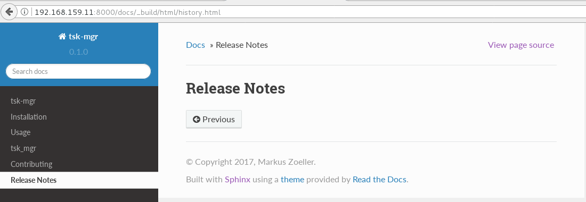
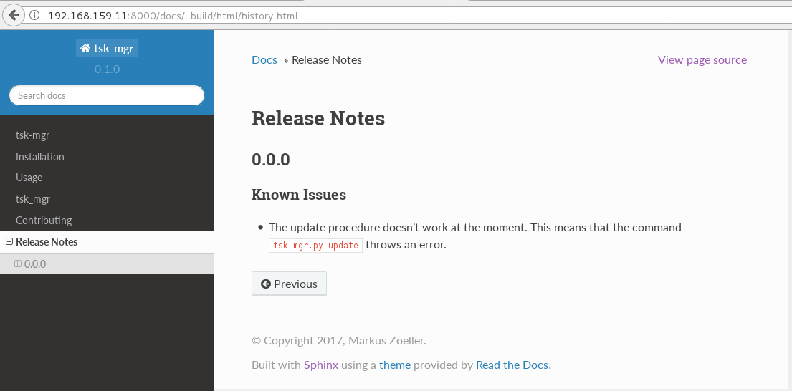
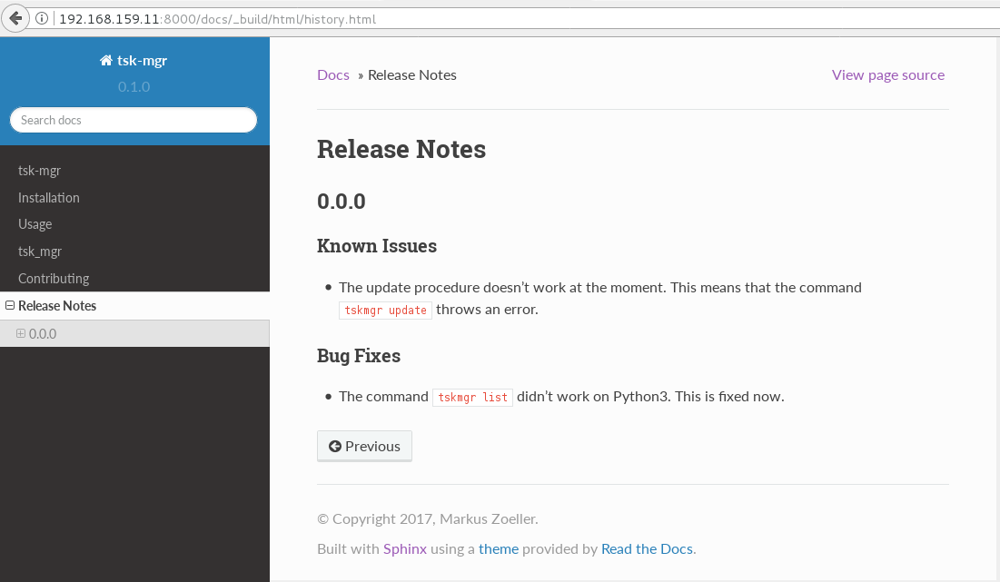

.. post::
   :tags: release-management
   :title: Release Notes with reno

=========================
Release Notes with *reno*
=========================

*"What features merged since the last release?"* --
*"Did we introduce something which might break a deployment?"* --
*"Let me grep through the commit history to check what happened."*
Remember sentences like these when you're about to release? If you
like this fire-fighting mode, ignore this post. If you want to have a
more relaxed release, this post will show you how to use a tool called
*reno* to manage your release notes.

.. contents::
    :local:
    :backlinks: top

.. todo:: date

.. list-table:: Change history:
   :widths: 1 5
   :header-rows: 1

   * - Date
     - Change description
   * - YYYY-MM-DD
     - The first release

TL;DR
=====

Below is the shortest end-to-end example I can think of. The steps are:

#. Install the needed software
#. Create a git repository
#. Create a release note with *reno*
#. Commit the release note to the repo
#. Create a report out of all committed release notes

I trimmed some of the unnecessary output with *[...]*:

.. code-block:: bash
   :linenos:
   :emphasize-lines: 0

    $ apt-get install -y git                     # reno operates on git repos
    $ git init                                   # initialize a git repo
    $ git config user.name "John Doe"            # configure git repo (1/2)
    $ git config user.email "jd@example.com"     # configure git repo (2/2)
    $ apt-get install -y python-pip              # we will install reno with pip
    $ pip install reno                           # install reno from PyPi
    $ reno new my-first-release-note             # create a release note
    Created new notes file in releasenotes/notes/my-first-release-note-21b284249cec129c.yaml
    $ git add -A                                 # Add the release note to the repo
    $ git commit -m "Add my first release note"  # commit the release note
    $
    $ reno list                                  # list the release notes
    scanning ./releasenotes/notes (branch=*current* earliest_version=None)
    including entire branch history
    21b284249cec129c: adding releasenotes/notes/my-first-release-note-21b284249cec129c.yaml from 0.0.0
    0.0.0
        releasenotes/notes/my-first-release-note-21b284249cec129c.yaml (01a57fb590b9145fbc6bd24bb924c8f62396bf22)
    $
    $ reno report                                # create a report
    scanning ./releasenotes/notes (branch=*current* earliest_version=None)
    including entire branch history
    21b284249cec129c: adding releasenotes/notes/my-first-release-note-21b284249cec129c.yaml from 0.0.0
    =============
    Release Notes
    =============

    0.0.0
    =====

    Prelude
    -------

    .. releasenotes/notes/my-first-release-note-[...]

    Replace this text with content [...]

    New Features
    ------------

    .. releasenotes/notes/my-first-release-note-[...]

    - List new features here, or remove this section. [...]

    Known Issues
    ------------

    .. releasenotes/notes/my-first-release-note-[...]

    - List known issues here, or remove this section. [...]

    Upgrade Notes
    -------------

    .. releasenotes/notes/my-first-release-note-[...]

    - List upgrade notes here, or remove this section. [...]

    Deprecation Notes
    -----------------

    .. releasenotes/notes/my-first-release-note-[...]

    - List deprecations notes here, or remove this section. [...]

    Critical Issues
    ---------------

    .. releasenotes/notes/my-first-release-note-[...]

    - Add critical notes here, or remove this section. [...]

    Security Issues
    ---------------

    .. releasenotes/notes/my-first-release-note-[...]

    - Add security notes here, or remove this section. [...]

    Bug Fixes
    ---------

    .. releasenotes/notes/my-first-release-note-[...]

    - Add normal bug fixes here, or remove this section. [...]

    Other Notes
    -----------

    .. releasenotes/notes/my-first-release-note-[...]

    - Add other notes here, or remove this section. [...]

Things you notice from this example are:

* *reno* creates its release notes in a directory ``releasenotes`` under
  the root directory of your project.
* A release note is a ``YAML`` file which uses a combination of the
  name you provided and a hash-like text. This ensures uniqueness in
  file names.
* The default template which our release note is based on used
  embedded *restructured text* for the markup of our prose.
* The report combines all of our release notes (only one so far) into
  something you can use in a release letter.
* The report also lists a version number (``0.0.0`` in this example)
  which can be influenced with *git tagging*.

.. note::
   Most of the content in this post is based on [#reno]_.

The next sections will dive deeper into specific questions on how to
use *reno* in your (most likely code driven) project.

Use Case
========

It got developed to fit the needs
of the *OpenStack* upstream development, but it can be used in any other
project as well.

.. todo:: describe the use case here

Benefits
========

* The release notes can be reviewed like code.
* The release note is part of the code change which makes the release note
  necessary.
* Backports to stable branches already contain the release note.
* Merge conflicts to the common release letter are next to impossible
* Have a (customizable) template of release specific sections which are
  the most important ones for your users
* A *Sphinx document generator* plugin is available.

Alternatives
============

Alternatives could be:

* Make the release note part of the git commit message.
* Only use files with a naming convention and parse them separately.
* Use the git notes feature.

The demo application and environment
====================================

This post contains an example application (called ``tsk-mgr``) we
will use to demo the usage of *reno* in a more real-world
manner. ``tsk-mgr`` is a TODO list management tool with a CLI interface and
persistence by using the Python shelve library [#shelve]_. It
has a ``docs`` directory which uses *Sphinx* [#sphinx]_ as documentation
generator. The structure of the app got created with *cookiecutter* [#cookie]_.

To reproduce the actions below on your local laptop, download the
:download:`project source files <release-notes-with-reno.tar.gz>`.
The environment is based on *Vagrant* [#vagrant]_. After extracting
the archive, use the demo environment like this:

.. code-block:: bash
   :linenos:
   :emphasize-lines: 0

   [markus@local]$ vagrant up
   [markus@local]$ vagrant ssh
   vagrant@reno:~$ sudo su -
   root@reno:~# cd /applications/tsk_mgr/
   root@reno:/applications/tsk_mgr# 2>/dev/null 1>&2 python -m SimpleHTTPServer &

Install and use the app like this:

.. code-block:: bash
   :linenos:
   :emphasize-lines: 0

   $ python setup.py develop   # install the app in development mode
   $ [...]
   $
   $ tskmgr --help             # call the app
   Demo Tasks Mgmt.

   Usage:
     tskmgr create <title>
     tskmgr list
     tskmgr update <id> <attr=value>...
     tskmgr (-h | --help)
     tskmgr --version

   Options:
     -h --help     Show this screen.
     --version     Show version.
   $
   $ tskmgr create "Write a post about reno"
   created: 5e16bde4-b1f6-4c9b-a090-cec9573c0a89 | Write a post about reno
   $
   $ tskmgr list
   Current tasks:
   * Write a post about reno

We build the documentation with:

.. code-block:: bash
   :linenos:
   :emphasize-lines: 0

   $ make docs       # alternatively: cd docs && make html

Under the covers, this uses the ``sphinx-build`` command from *Sphinx*,
but we won't dive deeper into this. Further reading can be found at
[#sphinxb]_.

Now you can access the documentation in your local browser via the
URL ``http://192.168.159.11:8000/docs/_build/html/index.html``. The
IP address got specified in the ``Vagrantfile`` and the port ``8000``
is the default for ``SimpleHTTPServer`` [#simplehttp]_.

If you don't like to use it anymore, destroy the environment with
``vagrant destroy -f`` and remove the directory. You're laptop will
be clean like nothing happened.

How to add the *reno* report to my documentation
================================================

We will use the file ``docs/history.rst`` for our release notes. We start
with this view of the application release history:

.. image:: images/sphinx_history_000_vwZSWlz.png
   :height: 300px
   :alt: Example app's documentation with Sphinx: Starting point

We will use the *reno* Sphinx extension:

.. code-block:: bash
   :linenos:
   :emphasize-lines: 0

    $ pip install 'reno[sphinx]'

After that, we can add it to the *Sphinx* configuration file at
``docs/conf.py``. This diff shows the line to add to the ``extensions``
list:

.. code-block:: diff
   :linenos:
   :emphasize-lines: 0

   diff --git a/docs/conf.py b/docs/conf.py
   index c6d3e26..031653c 100755
   --- a/docs/conf.py
   +++ b/docs/conf.py
   @@ -45,6 +45,7 @@ import tsk_mgr
    extensions = [
        'sphinx.ext.autodoc',
        'sphinx.ext.viewcode',
   +    'reno.sphinxext',
        ]

    # Add any paths that contain templates here, relative to this directory.

We will show the release notes in ``docs/history.rst``. Use the
``release-notes`` directive we gained from installing the *reno* *Sphinx*
extension:

.. code-block:: rst
   :linenos:
   :emphasize-lines: 0

   .. release-notes:: Release Notes

It's empty for now, as we haven't yet added a release note to this
project.

Add a release note and show it in the docs
==========================================

Let's assume we want to release the app (to *PypI* for example)
but we discovered that the update of tasks doesn't work. Instead of
delaying the release date, we create a release note which states this
known issue:

.. code-block:: bash
   :linenos:
   :emphasize-lines: 0

   $ reno new ki-update-not-working
   Created new notes file in releasenotes/notes/ki-update-not-working-8f89e1c561bc7c91.yaml

I used the prefix ``ki`` for *known issue*, but that's entirely optional.

Edit the *yaml* file with your editor of choice so that you have this
content:

.. code-block:: yaml
   :linenos:
   :emphasize-lines: 0

   ---
   issues:
     - >
       The update procedure doesn't work at the moment. This means that the
       command ``tsk-mgr.py update`` throws an error.

.. tip::

   The ``>`` char is *YAML folding syntax*. It replaces every line break
   with a space. If you want to keep the line breaks as you specified them,
   use the ``|`` char. More details at [#yamlsyn]_ or the official
   spec [#yamlspec]_.

Remember, *reno* works on your git repository. Add the release note
and commit it:

.. code-block:: bash
   :linenos:
   :emphasize-lines: 0

   $ git add -A
   $ git commit -m "Add known issue about update"

Build the docs again with ``make docs`` and refresh the history page:

Here you see that the embedded *restructured text* in the YAML file
can be interpreted and rendered by the *reno* *Sphinx* extension. This allows
you to format the release notes for easier consumption for your users.

Add a release note with a code change
=====================================

The examples before showed the usage of *reno* when no code was involved.
We change this by doing an actual fix in the application.

Our app works fine in *Python 2*, but the ``shelve`` library behaves
differently in *Python 3*. We see this issue:

.. code-block:: bash
   :linenos:
   :emphasize-lines: 0

   $ python -V
   Python 3.5.2
   $
   $ tskmgr list
   Traceback (most recent call last):
   [...]
   dbm.error: db type could not be determined

We fix this in the code and add a release note for the users to notice.
The git commit consists of two files:

* the changed functional code
* the release note for this

The diff looks like this:

.. code-block:: diff
   :linenos:
   :emphasize-lines: 0

   diff --git a/releasenotes/notes/bf-list-in-py3-a2ea5423b9d538f0.yaml b/releasenotes/notes/bf-list-in-py3-a2ea5423b9d538f0.yaml
   new file mode 100644
   index 0000000..8bf1bf5
   --- /dev/null
   +++ b/releasenotes/notes/bf-list-in-py3-a2ea5423b9d538f0.yaml
   @@ -0,0 +1,5 @@
   +---
   +fixes:
   +  - >
   +    The command ``tskmgr list`` didn't work on Python3. This is fixed now.
   +
   diff --git a/tsk_mgr/tsk_mgr.py b/tsk_mgr/tsk_mgr.py
   index 037840a..0f4bfa3 100755
   --- a/tsk_mgr/tsk_mgr.py
   +++ b/tsk_mgr/tsk_mgr.py
   @@ -121,7 +121,7 @@ class Persistence(object):

        def list_tasks(self):
            db = shelve.open(Persistence.FILE_NAME, writeback=True)
   -        tasks = db.values()
   +        tasks = [t for t in db.values()]
            db.close()
            return tasks

That's the beauty of release note management with *reno*. The documentation
is part of the very same code change.

The update documentation looks like this:

Release notes and versioning
============================

You might have noticed that the versions were off in the screenshots.
While the docs used the version number from within the project,
*reno* took the version number from the git repository, namely the
latest tag in the current branch. As we didn't yet tag the project,
*reno* used ``0.0.0``. We will change that by applying a git tag
and then list what *reno* has for this release:

.. code-block:: bash
   :linenos:
   :emphasize-lines: 0

   $ git tag 0.1.0
   $ reno list --version 0.1.0
   scanning ./releasenotes/notes (branch=*current* earliest_version=None)
   including entire branch history
   [...]
   0.1.0
       releasenotes/notes/bf-list-in-py3-[...]
       releasenotes/notes/ki-update-not-working-[...]

Let's add two more notes to see how this will be handled:

.. code-block:: bash
   :linenos:
   :emphasize-lines: 8

   $ reno new test
   $ reno new another-test
   $ git add -A
   $ git commit -m "even more release notes"
   $ reno list
   scanning ./releasenotes/notes (branch=*current* earliest_version=None)
   [...]
   0.1.0-2
       releasenotes/notes/another-test-[...]
       releasenotes/notes/test-[...]
   0.1.0
       releasenotes/notes/bf-list-in-py3-[...]
       releasenotes/notes/ki-update-now-working-[...]

For the **unreleased release notes** (here they are ``test`` and
``another-test``) *reno* simply uses the last git tag and adds a
counter for the number of release notes which will be released with
the next git tagging. After another version bump we see this:

.. code-block:: bash
   :linenos:
   :emphasize-lines: 5

   $ git tag 0.2.0
   $ reno list
   scanning ./releasenotes/notes (branch=*current* earliest_version=None)
   [...]
   0.2.0
       releasenotes/notes/another-test-[...]
       releasenotes/notes/test-[...]
   0.1.0
       releasenotes/notes/bf-list-in-py3-[...]
       releasenotes/notes/ki-update-now-working-[...]

The *Sphinx* extension for *reno* can also filter for version numbers:

.. code-block:: rst
   :linenos:
   :emphasize-lines: 0

   .. release-notes:: 0.1.0 Release Notes
      :version: 0.1.0

.. tip::

   This is a good way to split up the display of the release notes
   over multiple files, if you're concerned with showing too much
   at once.

Content
=======

.. todo:: add stuff here

Conclusion
==========

.. todo:: explain more here and reference to it [1]_

References
==========

.. [1] www.google.com

.. [#reno] https://docs.openstack.org/reno/latest/

.. [#vagrant] https://www.vagrantup.com/intro/index.html

.. [#cookie] https://pypi.python.org/pypi/cookiecutter/1.6.0

.. [#shelve] https://docs.python.org/2/library/shelve.html

.. [#sphinx] http://www.sphinx-doc.org/en/stable/

.. [#sphinxb] http://www.sphinx-doc.org/en/stable/man/sphinx-build.html

.. [#yamlsyn] http://yaml-multiline.info/

.. [#yamlspec] http://www.yaml.org/spec/1.2/spec.html#id2796251

.. [#simplehttp] https://docs.python.org/2.7/library/simplehttpserver.html
